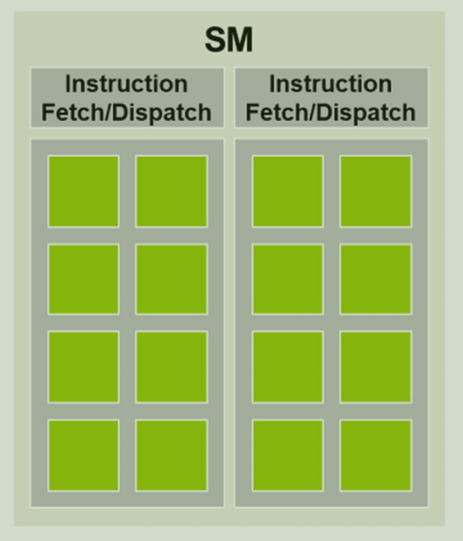

Would you operate on a human body without knowing its organs? Similarly, how can you effectively write a GPU kernel without understanding the underlying hardware? This is why it's crucial to understand how GPUs function. Knowing the philosophy behind their architectural design, the problems they aim to solve, and the reasons for their specific construction is essential for leveraging their full potential.

Exploring such a vast and complex topic can indeed be challenging. Fortunately, we don't need to be hardware engineers. We just need to firmly grasp the basics to understand how to fully utilize these processors in our machine learning endeavors.

## The Battle of the Brains: CPU vs. GPU
I bet my scalpels that you are familiar with programming using a CPU. Indeed, every machine learning engineer (or software engineer) must be able to do so. However, many of you may not be fully aware of the CPU's architectural design, perhaps because you never studied it during your academic journey. Still, I'm sure you can write perfectly functioning code.

Nowadays, a programmer can effectively write code that accomplishes tasks and solves problems without a deep understanding of the underlying CPU architecture. Modern programming practices and tools abstract away much of the complexity associated with hardware specifics. High-level programming languages and comprehensive development environments allow programmers to focus on algorithm design and functionality rather than hardware details. Additionally, compilers and interpreters perform automatic code optimizations, translating high-level code into efficient machine code tailored to the specific architecture. These optimizations ensure that the code runs efficiently on various CPUs, further diminishing the need for programmers to have in-depth knowledge of the hardware. Consequently, the ability to produce functional and efficient software relies more on logical and conceptual skills than on hardware-specific expertise.

In contrast to CPU programming, GPU programming necessitates a more intimate understanding of the underlying hardware to achieve optimal performance. This is because GPUs are designed with a fundamentally different architecture, emphasizing parallel processing capabilities. To leverage these capabilities effectively, programmers need to be aware of concepts such as thread hierarchies, memory coalescing, and warp execution. Unlike CPUs, where compilers can often perform extensive optimizations automatically, GPU programming requires manual optimization to fully exploit the hardware's potential. The programmer must write code that efficiently manages thousands of parallel threads and minimizes memory access latency. Consequently, achieving high performance in GPU programming involves a deep understanding of the GPU's architecture and the intricacies of its operation, making it significantly different from the more abstracted approach possible in CPU programming.

The figure below shows a comparison between the CPU and GPU architecture design, which is very helpful in understanding the purpose of both processors.

")

The CPU is designed for general-purpose processing and optimized for single-thread performance, enabling it to run a wide range of applications, from operating systems to specialized software. As illustrated in the figure, the CPU features a large cache memory and a few powerful cores. Additionally, it employs a hierarchical memory system, consisting of registers, multiple levels of cache, and main memory, ensuring rapid data access. To enhance its general-purpose processing capabilities, the CPU includes a complex instruction set, allowing it to perform a broad spectrum of operations.

On the other hand, the GPU is designed for parallel computing, following the Single Instruction Multiple Data ([SIMD](https://en.wikipedia.org/wiki/SIMD)) paradigm. The GPU design aims to maximize throughput by utilizing thousands of cores that compute simple operations in parallel. For memory, GPUs use High Bandwidth Memory (HBM) to facilitate very fast data flows in and out of the processor, while maintaining unified memory to enable communication between threads.

Enough with these generic notions. Put on your gloves, and let's cut open a GPU!


## Cerebral Cortex
The figure below illustrates the fundamental design of a modern GPU, primarily consisting of an array of Streaming Multiprocessors (SMs) and Global Memory.

")

Each SM contains a grid of CUDA cores, local memory, and a control unit. The distinction between local and global memory is crucial and must be considered when writing kernels, as loading and storing data between SMs and Global Memory can introduce significant overhead.


### Block Scheduling
Recall that in CUDA we call kernels as follows (example from [HelloCuda](https://dwarez.github.io/posts/hello-cuda/)):

```c
int number_of_threads = 256;
dim3 dimGrid(ceil(n/number_of_threads), 1, 1);
dim3 dimBlock(number_of_threads, 1, 1);
vecAddKernel<<<dimGrid, dimBlock>>>(A_d, B_d, C_d, n);
```

This results in the CUDA runtime spawning blocks of threads, which are assigned to individual SMs. In practice, each SM is responsible for executing multiple blocks. However, since each SM has a limited number of CUDA cores and memory, there is a limit to how many blocks can be assigned to it at a given time. Consequently, there is also a limit to how many threads can be executed simultaneously on a CUDA device. To manage this limitation, the CUDA runtime keeps track of all the spawned blocks and assigns new blocks to the SMs as they complete the execution of previous blocks.

The effort of assigning entire blocks to a single SM is well worth it. Since threads within the same block often need to communicate with each other, having them share the same SM allows them to use the SM's internal memory. This approach avoids the need for global memory access, which requires more time-consuming load and store operations.

Another key advantage of dispatching entire blocks to a single SM is **synchronization**. Kernel logic often requires synchronization to ensure that all threads reach a certain execution point before continuing with the computation. Even if threads are started simultaneously, their execution times can vary, and perfect timing synchronization is practically impossible. In practice, the threads' execution order is random.

Fortunately, the CUDA APIs provide a straightforward way to perform **barrier synchronization** with a single command:

```c
__syncthreads()
```
This command causes all threads in the block to wait at that point until every thread has reached the instruction. This ensures that all threads have completed the code preceding the barrier, allowing safe continuation with the subsequent code execution.


### Warps
As mentioned earlier, each SM contains a certain number of CUDA cores. Suppose that each core individually performes an instruction at a given time; in that case, the design would need to provide an **instruction fetch/dispatch unit** for each core, which would be inefficient given the large number of cores per SM. Additionally, to achieve significant throughput, the device must implement the SIMD paradigm.

To address these requirements, each SM is divided into **processing blocks**, each containing a certain number of cores and a single instruction fetch/dispatch unit to instruct the group of cores. The figure below illustrates an SM equipped with 16 CUDA cores, divided into 2 processing blocks.

<figure>
    
    <figcaption>Figure 4.8 of the <a href="[url](https://www.amazon.it/Programming-Massively-Parallel-Processors-Hands/dp/0123814723?tag=snxit51-21)">PMPP book</a></figcaption>
</figure>

To align the execution of kernels with this architectural implementation, **warps** were conceived. Whenever a block is assigned to an SM, it is further divided into warps, which are typically 32-thread units for NVIDIA GPUs. Note that the size of warps is implementation-specific and can vary between different architectures.

A warp is essentially the unit of thread scheduling in SMs. The 32 threads in a warp are contiguous, meaning they have a contiguous range of thread IDs. For example, if a block generates only one warp during execution, that warp will contain thread IDs ranging from 0 to 31.

We must consider how thread IDs are assigned within a warp. For a one-dimensional grid, the partitioning is straightforward: the array of threads is simply split into N contiguous parts, each consisting of 32 threads.
In the case of a two-dimensional grid, which forms a matrix, the array is first flattened into a one-dimensional array in a row-major order (i.e., first all elements of the first row, then all elements of the second row, and so on) and then split as the one-dimensional case.
For three-dimensional grids, we fix the value for the z-axis and then flatten the array as we would for the two-dimensional case. This process is repeated for each value of the z-axis.


### Control Divergence
While the use of processing blocks and warps provides execution optimization, it also introduces a hidden problem.

As mentioned earlier, all cores in a processing block share the same fetch/dispatch unit. Consequently, all threads in a warp execute the same instruction at a given time. But what happens with branches?

Consider a piece of code like:

```c
if (thread_id%2 == 0) {
    ...
}
else {
    ...
}
```

In this case, the execution of operations depends on the thread ID, so not all threads in a warp will be executing the same code simultaneously. Specifically, when threads with even thread IDs are computing the code inside the if brackets, threads with odd thread IDs will be idle, and vice versa.

This phenomenon is called **control divergence**, and it generally occurs whenever there is a control structure in the code that depends on the thread ID.

Control divergence silently suggests that we should try to avoid such control structures when writing a kernel to prevent code execution from diverging and wasting time on idle threads. However, it's not always possible to avoid these control structures, such as when checking the portion of data on which the thread must perform computations (similar to what we did in [HelloCuda](https://dwarez.github.io/posts/hello-cuda/)).


## Hippocampus
When optimizing GPU kernels, it's crucial to remember that performance improvements from processing optimizations are only part of the overall picture. A significant contribution also comes from efficient memory usage and effectively leveraging the GPU memory hierarchy.

With that in mind, let's explore a high-level overview of the GPU memory architecture design.


### Hierarchical Memory Design
Just as for the CPU design, the GPU architecture also specifies a hierarchical memory design, composed by several levels. As always, the size of the memory is inversely proportional to its speed and cost.

**Global Memory** is the largest and slowest type of memory on a GPU. If you followed the [Hello CUDA](https://dwarez.github.io/posts/hello-cuda/) tutorial, you have already used it without even knowing. Both the host and the device have read and write access to this memory. The long access latencies and relatively low access bandwidth of the Global Memory derives from the fact that it is not an on-chip memory and it is also implemented using the DRAM technology.
**Constant Memory** is similar to Global Memory but with one key difference: it supports high-bandwidth, read-only access by the device.

**Global Memory** is also used to create **Local Memory**, which shares the same properties in terms of latency and access. However, Local Memory is reserved for a single thread, meaning it is not shared among threads. Each thread has its own portion of dedicated Global Memory, typically used to allocate static arrays, spilled registers, and other elements of the thread’s call stack.

**Shared Memory** is an on-chip memory that allows threads within the same block to share data efficiently. It is much faster than Global Memory and helps minimize latency by reducing the number of accesses to Global Memory. Its primary purpose is to facilitate high-speed data sharing and cooperation among threads.

**Registers** are another type of on-chip memory. They are the fastest memory type and are assigned to individual threads, storing the most frequently accessed data for each thread.

Last but not least, **Texture Memory** is a specialized type of read-only memory in GPUs, optimized for two-dimensional spatial locality and specific access patterns commonly found in graphics rendering and image processing tasks. Its design provides significant performance benefits in various computational scenarios, utilizing techniques such as spatial locality and hardware interpolation/filtering. However, we will not delve too deeply into this type of memory here, as it is beyond the scope of this article.


It's crucial to remember this hierarchy when writing a kernel, as the speed differences between these memory types are highly noticeable and have a significant impact on the overall performance of the kernel. In modern GPUs, the combined access bandwidth of all the register files across all Streaming Multiprocessors (SMs) is at least two orders of magnitude higher than that of global memory!


### Memory Types in CUDA
Now that we have a clear high-level overview of the different types of device memory, the next logical step is to understand how to utilize them effectively when writing kernels. 
In CUDA, variables are declared with specific properties that dictate the type of memory they will use. These declarations also define the scope and lifetime of each variable, allowing for precise control over memory usage and performance optimization.

Here's a quick overview of the syntax and the resulting behaviour.


| Declaration                                    | Memory Type | Scope  | Lifetime    |
|------------------------------------------------|-------------|--------|-------------|
| Automatic Variables (arrays excluded)          | Register    | Thread | Grid        |
| Automatic Array Variable                       | Local       | Thread | Grid        |
| `__device__ __shared__ int SharedVariable`     | Shared      | Block  | Grid        |
| `__device__ int GlobalVariable`                | Global      | Grid   | Application |
| `__device__ __constant__ int ConstantVariable` | Constant    | Grid   | Application |


Let's explain in detail each row of this table.

Saying **non-array automatic variables** is just a fancy way of referring to scalars. Every variable of this type defined in a kernel or device function is automatically placed inside a thread register, meaning each thread will have its own version of the variable. Consequently, their lifespan is limited to the execution time of the thread.
You already know that registers are extremely fast, but be careful not to allocate too many scalar variables, as this can exceed the maximum capacity of the register storage. Using too many registers can negatively affect the **occupancy** of each Streaming Multiprocessor (SM).

**Array variables** are typically instead allocated in the Local Memory, however their scope and lifetime are the same of scalar variables.

Using the syntax `__shared__`, we specify that the variable must be shared among threads in the same block. Typically, a shared variable is declared inside the kernel function and used by threads within the same block to cooperate in computation. This is a convenient approach because Shared Memory is very fast.

By specifying only `__device__`, the variable will be allocated in Global Memory, making it a global variable. This means the variable is visible to all threads and persists throughout the entire application execution. Be cautious when dealing with global variables: the only robust way to ensure data consistency and synchronization across different blocks is to use atomic instructions.

Lastly, by using the `__constant__` syntax, we can define a constant variable, which will be allocated in Constant Memory. These variables are defined outside any function body, are visible to all threads in the grid, and their lifespan matches that of the application. This type of variable is typically used to provide constant inputs or data to kernels, as the variables' values cannot be modified by the kernels.


## Conclusion
I hope you enjoyed this dissection! By now, you should have gained a comprehensive high-level understanding of both the Cerebral Cortex and the Hippocampus of a GPU.

Throughout our exploration, we delved into the intricacies of Streaming Multiprocessors (SMs), warps, control divergence, and various memory types inherent to a GPU's architecture. These components collectively form the brain of a GPU, crucial for its processing power and efficiency.

It's important to recognize the profound interconnection between these two brain regions. When developing GPU code, one must consider both the Cerebral Cortex and the Hippocampus to ensure optimal performance and functionality. Neglecting either could lead to inefficiencies or errors in your code—something no true surgeon of GPU programming would permit!

That wraps up today's session! Remember to remove your gloves and wash your hands! Clear your mind and prepare for the next fascinating dive into the GPU programming world!
