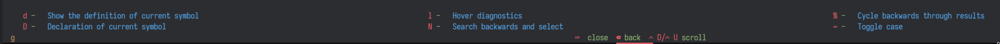

Undoubtedly, one of the most critical aspects of machine learning is understanding the theory—without grasping how machines learn, you'll never excel as an ML Surgeon! But being a surgeon isn't just about theory; it’s about getting your hands dirty—writing code, setting up infrastructures, and operating on the intricacies of data. That’s why having a tailored, efficient, and **functional** development setup is essential to stay productive and ensure everything gets done right.

In this brief article, I’ll walk you through **my personalized setup** for coding in Python, C/C++, and most importantly, CUDA. Keep in mind, this is a highly opinionated guide—what works for me might not work for everyone, so feel free to adapt it to your own needs.

This article will be over before you know it, so no need to put on your gloves!

## Prepping for Surgery: My Development Setup
In general, I’m not a fan of abstraction—in fact, I despise it. I want full control and awareness of everything happening under the hood. This principle guides me across many domains, including software development. So, as you explore my setup, remember that this desire for control is often the reason behind the decisions I’ve made.

### The OS: Choosing the Right Operating Room
>⚠️Note: When I refer to "Linux," I mean a Linux distribution, which serves as an operating system. I understand that Linux itself is just the kernel.

For the past 13 years, I’ve relied on Linux as my operating system of choice. I believe it’s the ideal platform for developers because it offers **complete control** over your machine, and the open-source community continuously creates and supports an array of incredible tools that you can use freely for personal projects or professional work. Unless you’re aiming to develop for specific environments, such as Apple software, I see no reason not to use Linux.

Throughout my extensive experience with Linux, I’ve experimented with various distributions, desktop environments, tools, and much more. Ultimately, I always gravitate toward an [**Arch**](https://archlinux.org/)-based distribution. Currently, I’m using Arch Linux itself, but I also find myself comfortable with EndeavourOS and similar alternatives.

I prefer to use a **tiling window manager**, specifically [Hyprland](https://hyprland.org/). I believe that tiling window managers enhance productivity by optimizing screen space and reducing excessive mouse usage, which is often unnecessary for many tasks.

### The Terminal: Your Scalpel 
The terminal is an essential tool for a developer, much like a scalpel is for a surgeon. You can accomplish nearly everything in it: writing code, managing files and Git repositories, compiling or interpreting code, and launching commands for all kinds of purposes. Because of its importance, it’s one of the tools I configure most thoroughly—it must seamlessly align with my workflow.

My current terminal emulator of choice is **Kitty**, though any terminal that suits your needs will do. As for the shell, I use **zsh**, which I find superior to **bash in many ways. I’ve experimented with **fish** and **nushell**, but I always return to zsh. While zsh lacks certain features like syntax highlighting and command suggestions, these can easily be added through plugins managed by a plugin manager (I use **OhMyZsh**).

In combination with zsh, I rely on **tmux** for handling multiple windows and panes. This is invaluable when working with several terminal panes simultaneously. With tmux, I can avoid opening multiple instances of Kitty and instead efficiently navigate between panes, split views, detach commands, and more. If you haven’t used tmux yet, I highly recommend giving it a try. I also use **TPM** (Tmux Plugin Manager) to manage external plugins, which further enhance tmux’s functionality.

To streamline my workflow, I’ve customized my `.zshrc` file to automatically launch a tmux session whenever I open a terminal, which saves time and keeps everything organized.


### The Editor: Precision Tools for Code Surgery
If you use an IDE, I don’t blame you. Setting up a proper development environment can be challenging, and IDEs simplify that process by offering a suite of tools and configurations right out of the box. However, this convenience clashes with my need for total control, which is why I stopped using them a long time ago.
For years, I relied on **Visual Studio Code**, which, at its core, is just an editor that can be transformed into an IDE with extensions and straightforward configuration. But recently, I’ve grown frustrated with some of its limitations—its sluggishness (mainly due to its background trackers), and the often confusing and overlapping configurations, which make it difficult to pinpoint the cause of specific behaviors.
That’s when I decided to give **Neovim** a try, and I was genuinely impressed by its speed and workflow—once you get past the steep learning curve. Learning **Vim motions** transforms your workflow completely, reducing your dependency on the mouse. This approach aligns closely with the philosophy of tiling window managers and provides a significant boost to both productivity and speed.

Neovim is highly customizable and extensible, much like how you can extend VS Code with plugins. However, the key difference is control. With Neovim, every aspect of the configuration is in your hands. You must be deliberate about which plugins you install, how you configure them, and their specific purposes. This results in a clean, optimized setup that is far faster and more efficient than any traditional IDE.
If the process of configuring Neovim from scratch seems daunting, you can start with **pre-built distributions** like **AstroVim** or **LunarVim**, which handle most of the initial setup for you. However, I still recommend understanding their inner workings—it will be crucial if you want to further customize and optimize your environment down the road.


## Performing the Procedure: A CUDA + Libtorch Case Study
In this part, I’ll give you a glimpse of how I use my environment to write a CUDA kernel while also utilizing **Libtorch**. For those unfamiliar, Libtorch is the C++ distribution of PyTorch, offering C++ APIs based on the **ATen** library. To start, head over to the [Get Started Page](https://pytorch.org/get-started/locally/) and download the appropriate distribution. In my case, I’m using the version with CUDA 12.4 and cxx11 ABI support, but for our example, the exact version isn’t crucial.

Once downloaded, extract the library into your home folder—that’s about it for the "installation" process.

Next, I create a project folder and open it in Neovim. Since I’ll be working with both C++ and CUDA, I’ve configured `clang`, a language server that supports both languages, ensuring smooth linting and formatting.
I start by writing the CUDA kernel and immediately notice linting and formatting in action, courtesy of clang. Pretty cool!

However, clang doesn’t seem to recognize Libtorch’s imports—this is expected since we simply have the library sitting in our home directory, and clang isn’t aware of it. Clang relies on a **compilation database** to inform it about external libraries, languages, and the specific commands needed to compile the project and generate binaries. We need to provide this information to clang so it can lint the Libtorch imports correctly!

To achieve this, we can generate a `compile_commands.json` file using [Bear](https://github.com/rizsotto/Bear), a simple command-line tool that generates the necessary compile commands. Just run it like this:
```sh
bear - [[command for compiling]]
```
That’s all! Alternatively, you could use CMake to handle this, but personally, I avoid CMake whenever possible.

Great! Now I can start programming. But wait—I forgot the parameters for the `torch::rand` function! Normally, I’d have to leave my editor, open a browser, navigate through results, and waste time hunting down the documentation. Or, thanks to my Neovim setup, I can simply hover over the method name, press `Shift+K`, and voilà—a documentation pop-up appears directly in my editor!


This pop-up displays useful information like the library providing the method, input and output parameters, and the function signature. When available, it even shows the method’s docstring!

But that’s not all—if I want to check the definition of something, I can hover over it (easily done with Vim motions), press `gD`, and jump straight to its definition. Pretty handy!

I can already hear you saying, "But Dario, how am I supposed to remember all these keybindings?" Well, Neovim can be configured to display **suggestions** as you type key sequences. For example, if I hover over the `torch.rand` method and press `g`, this suggestion view will pop up:



I could go on all day about the editor and its capabilities, but that’s not the focus of this post. Let’s move on to compiling and running our program!

### Compiling and Running a CUDA + C++ Project: Suturing Together CUDA and C++ with Libtorch
Let’s start with the compilation command, which we’ll also use with Bear to generate the `compile_commands.json` file. Since we’re working with C++, CUDA, and Libtorch, we need to be mindful of the compilation flags, ensuring that all necessary information is correctly specified to compile the program.

First, we’ll use `nvcc` as the compiler, since `g++` can’t handle the CUDA syntax in `cu` or `cpp` files. Additionally, because Libtorch requires the C++17 standard, we must explicitly specify that during compilation. And since we haven’t installed Libtorch in a system-wide directory (meaning it’s not in a path that the linker will automatically search), we need to provide the correct path to the Libtorch library.

We also want to enable **CUDA acceleration**, so we’ll include the relevant CUDA flags. It’s possible that nvcc already includes these by default, so this part might not be strictly necessary—feel free to experiment and see what works for you!

Finally, we’ll add flags for **cross-compilation** and linking, position-independent code, and use the --no-as-needed flag with the linker to ensure all required libraries are included.

Here’s the resulting command:

```sh
nvcc -std=c++17 -I/path/to/libtorch/include -I/path/to/libtorch/include/torch/csrc/api/include \
-L/path/to/libtorch/lib -ltorch -ltorch_cpu -lc10 -lcuda -lcudart \
-Xcompiler -fPIC -Xlinker --no-as-needed -o my_program csrc/main.cu
```

Running this command will generate the `my_program` executable. Let’s try running it:

```sh
$ ./my_program

./my_program: error while loading shared libraries: libtorch.so: cannot open shared object file: No such file or directory
```

Well, that doesn’t look like a tensor at all! The issue here is familiar: since we didn’t install the Libtorch library system-wide, the operating system doesn’t know where to find `libtorch.so`. We need to explicitly tell it by exporting the library path:

```sh
export LD_LIBRARY_PATH=/path/to/libtorch/lib:$LD_LIBRARY_PATH`
```

Running the program again will now execute successfully. Keep in mind, though, that this export is only valid for the current terminal session. If you want to make it permanent, you can add this export command to your `.zshrc` (or equivalent file for your shell).

## Post-Op: Final Thoughts and Recovery
In conclusion, setting up a development environment tailored for CUDA, C++, and Libtorch may feel like stitching together a complex surgery—but once you get the hang of it, it’s smooth sailing (or should I say, smooth compiling?). With the right tools, a bit of configuration magic, and a trusty terminal scalpel, you’ll be slicing through code like a seasoned ML Surgeon in no time. Happy coding, and remember—always keep your tools sharp!
