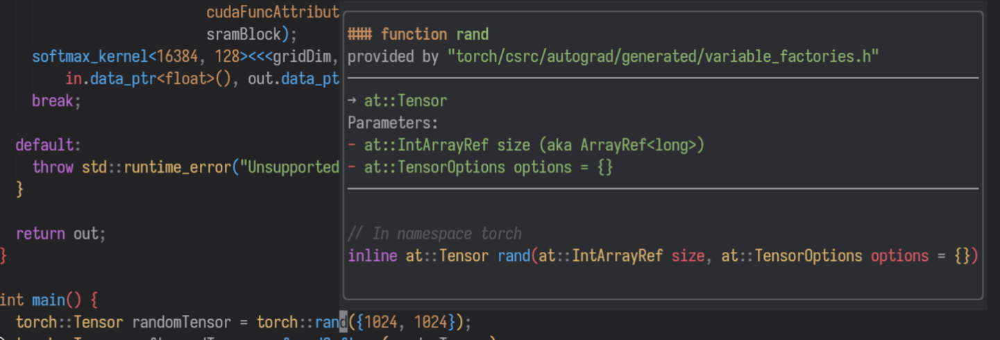

Undoubtedly, one of the most critical aspects of machine learning is understanding the theory—without grasping how machines learn, you'll never excel as an ML Surgeon. But being a surgeon isn't just about theory; it’s about getting your hands dirty—writing code, setting up infrastructures, and operating on the intricacies of data. That’s why having a tailored, efficient, and **functional** development setup is essential to stay productive and ensure everything gets done right.

In this brief article, I’ll walk you through **my personalized setup** for coding in Python, C/C++, and most importantly, CUDA. Keep in mind, this is a highly opinionated guide—what works for me might not work for everyone, so feel free to adapt it to your own needs.

This article will be over before you know it, so no need to put on your gloves!

## A Machine Learning Surgeon development setup

In general, I’m not a fan of abstraction—in fact, I despise it. I want full control and awareness of everything happening under the hood. This principle guides me across many domains, including software development. So, as you explore my setup, remember that this desire for control is often the reason behind the decisions I’ve made.

### The OS
>⚠️Note: When I refer to "Linux," I mean a Linux distribution, which serves as an operating system. I understand that Linux itself is just the kernel.

For the past 13 years, I’ve relied on Linux as my operating system of choice. I believe it’s the ideal platform for developers because it offers **complete control** over your machine, and the open-source community continuously creates and supports an array of incredible tools that you can use freely for personal projects or professional work. Unless you’re aiming to develop for specific environments, such as Apple software, I see no reason not to use Linux.

Throughout my extensive experience with Linux, I’ve experimented with various distributions, desktop environments, tools, and much more. Ultimately, I always gravitate toward an [**Arch**](https://archlinux.org/)-based distribution. Currently, I’m using Arch Linux itself, but I also find myself comfortable with EndeavourOS and similar alternatives.

I prefer to use a **tiling window manager**, specifically [Hyprland](https://hyprland.org/). I believe that tiling window managers enhance productivity by optimizing screen space and reducing excessive mouse usage, which is often unnecessary for many tasks.

### The terminal
The terminal is an essential tool for a developer, much like a scalpel is for a surgeon. You can accomplish nearly everything in it: writing code, managing files and Git repositories, compiling or interpreting code, and launching commands for all kinds of purposes. Because of its importance, it’s one of the tools I configure most thoroughly—it must seamlessly align with my workflow.

My current terminal emulator of choice is **Kitty**, though any terminal that suits your needs will do. As for the shell, I use **zsh**, which I find superior to bash in many ways. I’ve experimented with **fish** and **nushell**, but I always return to zsh. While zsh lacks certain features like syntax highlighting and command suggestions, these can easily be added through plugins managed by a plugin manager (I use **OhMyZsh**).

In combination with zsh, I rely on **tmux** for handling multiple windows and panes. This is invaluable when working with several terminal panes simultaneously. With tmux, I can avoid opening multiple instances of Kitty and instead efficiently navigate between panes, split views, detach commands, and more. If you haven’t used tmux yet, I highly recommend giving it a try. I also use **TPM** (Tmux Plugin Manager) to manage external plugins, which further enhance tmux’s functionality.

To streamline my workflow, I’ve customized my `.zshrc` file to automatically launch a tmux session whenever I open a terminal, which saves time and keeps everything organized.

### The editor
If you use an IDE, I don’t blame you. Setting up a proper development environment can be challenging, and IDEs simplify that process by offering a suite of tools and configurations right out of the box. However, this convenience clashes with my need for total control, which is why I stopped using them a long time ago.
For years, I relied on **Visual Studio Code**, which, at its core, is just an editor that can be transformed into an IDE with extensions and straightforward configuration. But recently, I’ve grown frustrated with some of its limitations—its sluggishness (mainly due to its background trackers), and the often confusing and overlapping configurations, which make it difficult to pinpoint the cause of specific behaviors.
That’s when I decided to give **Neovim** a try, and I was genuinely impressed by its speed and workflow—once you get past the steep learning curve. Learning **Vim motions** transforms your workflow completely, reducing your dependency on the mouse. This approach aligns closely with the philosophy of tiling window managers and provides a significant boost to both productivity and speed.

Neovim is highly customizable and extensible, much like how you can extend VS Code with plugins. However, the key difference is control. With Neovim, every aspect of the configuration is in your hands. You must be deliberate about which plugins you install, how you configure them, and their specific purposes. This results in a clean, optimized setup that is far faster and more efficient than any traditional IDE.
If the process of configuring Neovim from scratch seems daunting, you can start with **pre-built distributions** like **AstroVim** or **LunarVim**, which handle most of the initial setup for you. However, I still recommend understanding their inner workings—it will be crucial if you want to further customize and optimize your environment down the road.

## A CUDA + Libtorch example 
In this section, I'd like to give to you an idea of how how I use my environment to write a CUDA kernel also using Libtorch.
In case you didn't know, Libtorch is the C++ distribution of PyTorch, which provides C++ APIs still based on the ATen library. So, first thing first, let's download the distribution on the [Get Started Page](https://pytorch.org/get-started/locally/). I'm downloading the distribution with CUDA 12.4 and cxx11 ABI support, but that's not that relevant for our example.

Once downloaded, I will extract it in my home folder and that's pretty much it as the "installation" goes.

Now, I'll create a folder project and open it using Neovim. Since I'll be writing C++ and CUDA code, I made sure to install and configure clang, which is an LSP server which supports C++ and CUDA languages.

I start by writing the CUDA kernel, and instantly notice that I have linting and formatting capabilities, thanks to clang. Quite cool!

However, it seems like that the `libtorch`'s imports are not recognized by clang! This is expected, since we simply have the library's content in our home folder, and clang is not aware of it. Tools like clang work using a **compilation database**, which informs the tool about the languages, external imports and commands that will be executed to compile the project and generate the binaries. We have to provide this information to clang in order to make it lint also for libtorch's external source!
We can generate a `compile_commands.json` file with bear

But a problem immediatly arises: I can't remember the parameters for the `torch::rand` function! Now I have to leave my editor, go to the browser, use my mouse to click on results and waste time looking in the online documentation! Or, given my Neovim configuration, I can just hover over the method name, press `Shift+K` and ta-da, I can now read a documentation pop-up, directly from my editor!

This pop-up shows a lot of useful information, like which library provides the method, which are the input and output parameters and the signature of the method. When provided, it will also show the docstring of the method/function!

