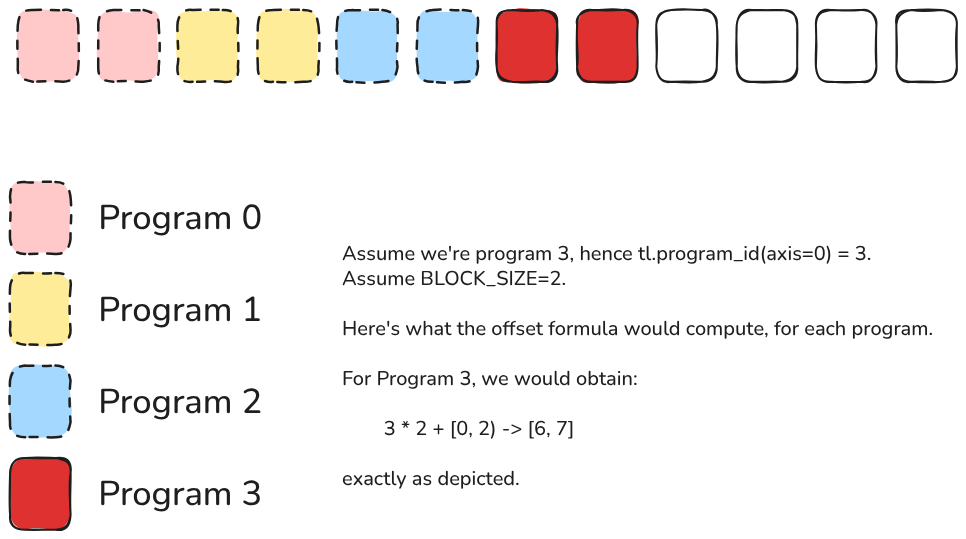

We all know that GPU programming is hard. There are many layers of complexity that make writing a kernel difficult: thinking in a parallel way (which goes against our natural sequential thinking), understanding the math behind a certain operation, keeping track of data movement, memory hierarchies, occupancy, concurrency, boundaries, and much more.
Adding to that complexity, the languages used to write kernels aren't straightforward for all developers, especially if you come from an AI/ML background and aren't familiar with low-level programming.

But here's an even bigger catch: once you write your kernel in, let's say, CUDA, it's typically optimized for a specific GPU. Sure, you can compile it for different platforms, but all the considerations based on your hardware specs won't necessarily apply to other hardware. Plus, the kernel will only run on Nvidia GPUs, what about everything else? Portability is a huge factor in programming. Being able to reuse code and run it anywhere is one of the main benefits of modern languages that abstract away the underlying hardware. However, this doesn't apply to GPU programming.
These are some of the reasons why OpenAI announced Triton in 2021, a Python-native language that lets programmers write kernels in pure Python and run them on a wide range of accelerators. The idea of writing a performant and efficient kernel in pure Python that could run on many different platforms seemed like a pipe dream, but nowadays it's reality.

This is why I'd like to introduce you to this fantastic tool that's now at our disposal, teach you the basics, and show you an amazing website that the ML Sys community built from scratch to help democratize GPU programming.

Put on your gloves, we're getting started!


## Before Starting: Setting the Foundation
### LeetGPU: Your Virtual Laboratory for Parallel Computing
First, let me introduce you to the leetgpu.com platform. Think of it as Leetcode, but for GPU programming. The incredible part is that the platform not only supports different languages (CUDA, Triton, PyTorch, Tinygrad, and Mojo) but also provides free GPU access to run and submit your code! This is absolutely huge! You now have the opportunity to learn GPU programming even without owning a GPU!

The website offers resources for all these frameworks plus a collection of puzzles with increasing difficulty that you can freely run and submit on various hardware options. The platform also lets you compare your solutions with others, so you can see how efficient your implementation is compared to the community.

This truly represents an extraordinary opportunity to dive into GPU programming, so don't let it slip by! I wish this platform had existed when I was starting out, it would have transformed my entire learning journey!


### Triton's Programming Model: Abstracting Complexity into Elegance
Before exploring the code, let's first talk a bit about Triton's programming model.

If you're familiar with CUDA, you know there are two levels of computation: blocks and threads. Each block contains a certain number of threads, and everything exists within a grid structure. For more details about CUDA's programming model, check out my article [[TODO:]].

Triton, however, operates only at the block level. This means we work with vectors rather than the scalars you'd handle in CUDA. Another key difference is that shared memory becomes abstracted from the programming model. Triton manages it for us automatically. You can see that CUDA offers finer granularity, which gives you more control but also adds complexity.

To illustrate this clearly: in CUDA, we access matrix elements like this: A[m, k], which represents a scalar, a single value. In Triton, we access elements through slicing: A[m: m+MB, k: k+KB].
Understanding these fundamental differences is crucial for making a smooth transition from CUDA to Triton programming.


## First Puzzle: Vector Addition - The "Hello World" of Parallel Computing
Alright, time to dive in. Let's start with the first LeetGPU puzzle: Vector Addition. As you probably know, this is essentially the "Hello World" of GPU programming.


The problem statement is straightforward:

> Implement a program that performs element-wise addition of two vectors containing 32-bit floating point numbers on a GPU. The program should take two input vectors of equal length and produce a single output vector containing their sum.

Pretty clear. The constraints are:

> * Input vectors A and B have identical lengths
> * 1 ≤ N ≤ 100,000,000

The platform also provides a starting script:

```python
# The use of PyTorch in Triton programs is not allowed for the purposes of fair benchmarking.
import triton
import triton.language as tl

@triton.jit
def vector_add_kernel(a_ptr, b_ptr, c_ptr, n_elements, BLOCK_SIZE: tl.constexpr):
    a_ptr = a_ptr.to(tl.pointer_type(tl.float32))
    b_ptr = b_ptr.to(tl.pointer_type(tl.float32))
    c_ptr = c_ptr.to(tl.pointer_type(tl.float32))
    
# a_ptr, b_ptr, c_ptr are raw device pointers
def solve(a_ptr: int, b_ptr: int, c_ptr: int, N: int):    
    BLOCK_SIZE = 1024
    grid = (triton.cdiv(N, BLOCK_SIZE),)
    vector_add_kernel[grid](a_ptr, b_ptr, c_ptr, N, BLOCK_SIZE)
```

Let's analyze the information from this snippet.

First, the `@triton.jit` decorator specifies that the function will be compiled just-in-time using the Triton compiler. So we can consider `def vector_add_kernel` the actual kernel we need to implement. Something very important to understand: whenever a function is decorated with `triton.jit`, its input parameters get implicitly converted to pointers. That's why we refer to `a_ptr`, it means we're working with the pointer addressing tensor `a`.


The `tl.pointer_type` function gets called to cast the tensors to the `tl.float32` type.

For this problem, we accept three tensor pointers as input: two for the input tensors to sum, and one to store the result. We also need the number of elements `n_elements` (an integer) and the block size `BLOCK_SIZE` (also an integer). However, for the latter, we use the type `tl.constexpr`, which simply states that the variable's value is known at compile time. This applies to the block size variable because it's statically set to 1024, but not to the number of elements since that depends on the input tensor shapes.

But what exactly is the block size? It's very similar to the same concept in CUDA, except here we refer to the number of program instances grouped together in a single block, rather than threads. Think of it as a hyperparameter: its optimal value depends on both the hardware and the kernel we're executing. Just remember that the block size **must** be a power of 2!

Finally, these lines create the execution grid and invoke the kernel:

```python
grid = (triton.cdiv(N, BLOCK_SIZE),)
vector_add_kernel[grid](a_ptr, b_ptr, c_ptr, N, BLOCK_SIZE)
```

Notice how the grid defines the number of kernel instances (programs) that will run in parallel. It can be either a tuple (`Tuple[int]`) or a callable function (`Callable`) with metaparameters. Here, the grid size is computed using the `triton.cdiv` function, which is simply a ceiling division. This ensures we have enough blocks to cover all elements in the input vectors.


### Implementing the Kernel: From Theory to Practice
We can now proceed and implement the actual kernel that will perform the vector sum.

The steps are quite simple and straightforward. First, we need to load the tensors from DRAM. Then, we simply sum them. Finally, we store the result in the output tensor.

This problem is particularly simple because all three tensors have the same length, which greatly simplifies the kernel since we don't need to manage different lengths or dimensions like in 2D or 3D problems.

Enough talk, let's write some code and follow the steps we just outlined.

To load the tensors into memory, we need to invoke the `tl.load` function. We'll call this function by specifying a pointer and a mask. But how do we compute the pointer we need to use? We have the start of the pointer, specified by the input parameter `a_ptr` (or `b_ptr`, assuming `a` and `b` are our input tensors and `c` is the output), but that's just the beginning of the address that stores the tensor. We need to move by an offset that depends on which program we're in, because each program has to compute the sum for a specific subset of the tensor.

We can identify which program we're in using the `program_id` function:

```python
tl.program_id(axis=0)
```

Here we specify `axis=0` because we'll launch a 1D grid. If you know CUDA, this will sound very familiar, but it's definitely more straightforward than using block and thread IDs.

Now, since each program must compute the sum over only a section of the input vectors, we need to skip the first `N` block sizes, where `N` is the program identifier. In practice, if we're in `program 1`, that means `program 0` will process the first `BLOCK_SIZE` elements, so we skip them. The same applies to any other index and its predecessors. We achieve this by simply multiplying the program ID by the block size:

```python
tl.program_id(axis=0) * BLOCK_SIZE
```

Great! Now we have the start of the address that must be processed by the program. To access all the elements that must be processed by the program, we need to create a range of pointers spanning from the start to the end of the section that must be accessed by the program. The span is, by definition in this case, the block size. We'll use the `tl.arange` function for this:

```python
tl.arange(0, BLOCK_SIZE)
```

This function simply creates a tensor with values spanning from `0` to `BLOCK_SIZE`.

Then, we sum these two components to obtain the final offsets we need to use in our program:

```python
offset = tl.program_id(axis=0) * BLOCK_SIZE + tl.arange(0, BLOCK_SIZE)
```

Here's an example of what would happen:


Now that we have the offsets, we can load our tensors. But wait, there's a catch: since the block size can only be a power of two, we could run into cases where some of the computed offsets are out of bounds for the tensor's memory allocation. Therefore, when loading the values, we must ensure to use only valid offsets. We can easily achieve this using a mask, like this:

```python
mask = offset < n_elements
```

This will generate a boolean mask where each value in the mask that corresponds to the same position in the offsets tensor has value 1 if it's valid or 0 if it's not. This mask can be used in the `tl.load` function as follows:

```python
tl.load(a_ptr + offset, mask=mask, other=0.0)
```

and the function will automatically load the values in valid positions, while setting to the `other` value all of the positions that are set to `0` in the mask. In this case, we simply set the `other` parameter to 0.

So, we can load both input tensor values as follows:

```python
a = tl.load(a_ptr + offset, mask=mask, other=0.0)
b = tl.load(b_ptr + offset, mask=mask, other=0.0)
```

Once in memory, we can simply sum the loaded values:

```python
c = a + b
```

Finally, we store the result using the `tl.store` function. Notice how the parameters are very similar: we specify where to store, which values to store, and which mask to use.

```python
tl.store(c_ptr + offset, c, mask=mask)
```

And that's it!


## Wrapping Up: Your First Steps into GPU Programming

And there you have it! We've just walked through your first Triton kernel, and honestly, it's pretty amazing how straightforward it becomes once you break it down step by step.

What we've accomplished here might seem simple on the surface, adding two vectors together, but you've actually crossed a significant threshold. You've moved from being someone who uses GPU-accelerated libraries to someone who can write GPU code directly. That's a pretty big deal!

The beauty of what we just did lies in how Triton removes so much of the traditional GPU programming headaches. No more worrying about thread synchronization, no more manual shared memory management, no more getting lost in the maze of CUDA's complexity. Just clean, readable Python that gets compiled into efficient GPU code.

This vector addition kernel is your "Hello World" moment, but it's also your foundation. The same patterns we used here (calculating offsets, creating masks, loading data, performing operations, and storing results) these will show up in practically every kernel you write from now on. Whether you're implementing matrix multiplication, convolutions, or custom attention mechanisms, you'll be using these same building blocks.

The real game-changer is having platforms like LeetGPU.com where you can actually practice this stuff without needing your own GPU setup. I can't stress enough how valuable that is for learning. Back in the day, getting started with GPU programming meant either having expensive hardware or begging for cluster time. Now you can just open a browser and start coding.

So what's next? Go play around! Try the other puzzles on LeetGPU, experiment with different block sizes, see how your implementations compare to others. The more you practice, the more intuitive this parallel thinking becomes.

Welcome to the world of GPU programming, you're going to love it here!