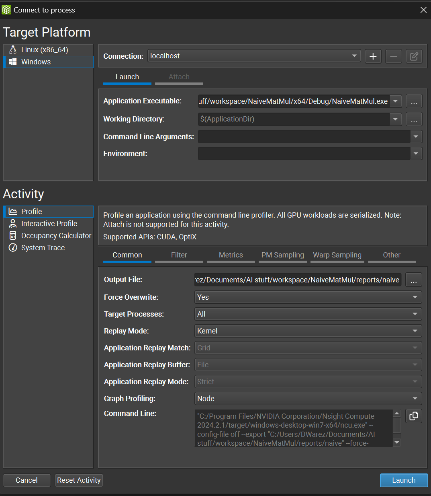
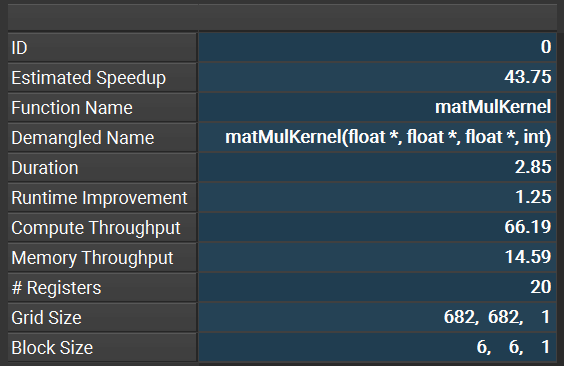
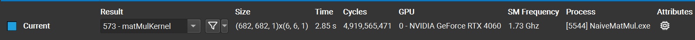
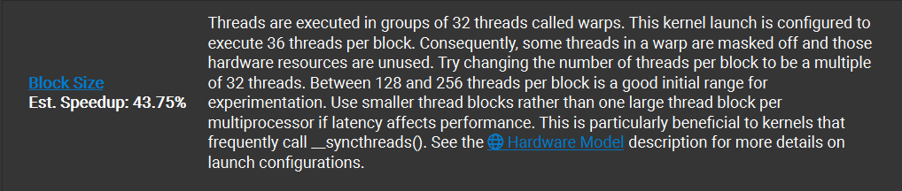
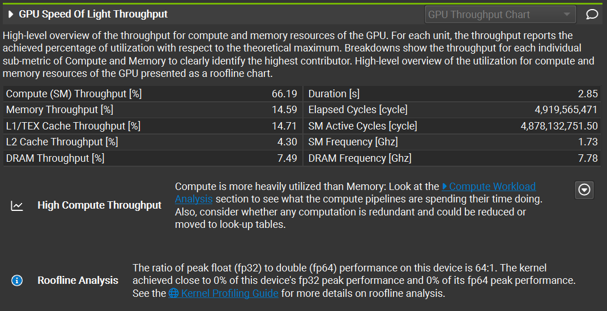
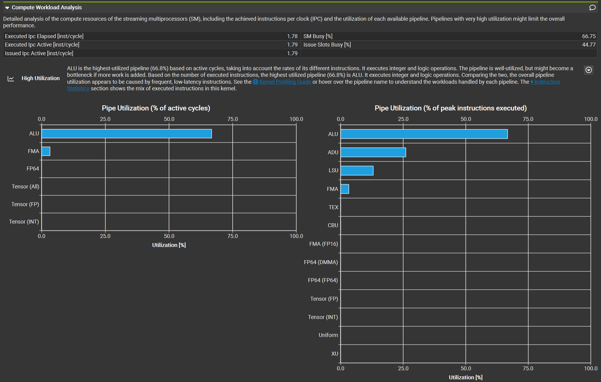
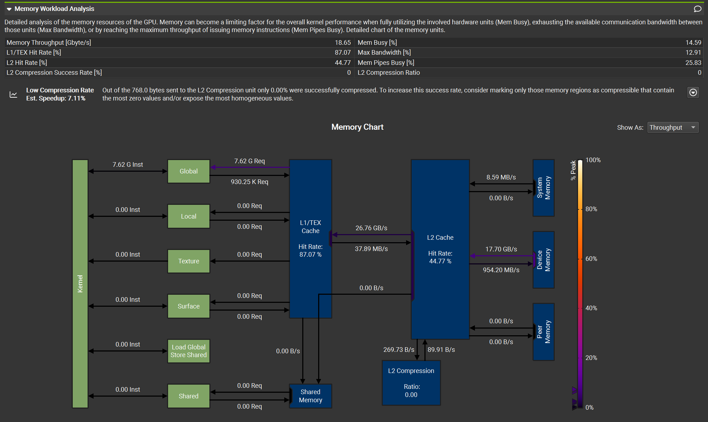
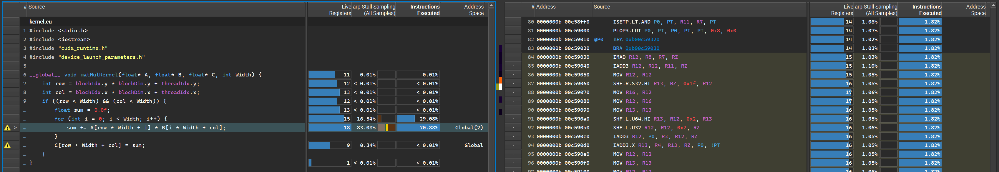

Being a Machine Learning Surgeon is not an easy life. We not only have to deal with intricate machine learning systems but also navigate the additional complexities surrounding them. To be a proficient ML Surgeon, we must develop a diverse skill set. First and foremost, we need a deep understanding of machine learning and deep learning. Additionally, we must be adept at writing software, building infrastructures to host and integrate models, managing large volumes of data, and much more. This requires familiarity with numerous tools.

One fundamental tool in our toolkit is the **profiler**. Profiling involves performing dynamic code analysis to illustrate various performance indicators, such as memory usage and computational complexity.

When dealing with GPU programming, profiling becomes even more crucial. Our main objective is to maximize performance by utilizing hardware resources as efficiently as possible. Given the unique architecture of GPUs and their specific characteristics, writing a perfect kernel that leverages all possible optimizations is a challenging task.

Fortunately, tools are available to help us with this difficult task. Today, we will explore how to use [NVIDIA Nsight Compute](https://developer.nvidia.com/nsight-compute) to profile kernels and understand how we can optimize them.

This time, you won't need any scalpels, so sit back and relax!

## Preparing for Surgery
Before we can proceed with our profiling sessions, we need two things: the profiling tool and a kernel to profile.

I particularly enjoy using NVIDIA Nsight Compute —a tool developed by NVIDIA— because it provides an excellent interface to the CLI programs of the NVIDIA CUDA Toolkit. It offers a wealth of information and insights about the profiled kernel or application. The tool is very easy to install; simply follow the [installation guide](https://developer.nvidia.com/tools-overview/nsight-compute/get-started).

For this introductory tutorial, I'll profile some matrix multiplication kernels, which are slightly modified versions of the ones you can find in [this previous blogpost](https://dwarez.github.io/posts/matrix-multiplication/).

To illustrate the profiler's capabilities, we will analyze a poorly performing kernel. This will result in a much more interesting and insightful report!

### Initiating the Procedure
After opening our project, we can click on *Open Connection Dialog* to configure the profiling activity we are going to launch, as shown in the figure below:

As you can see, this menu is split into two parts: platform-specific settings on the top and activity specifics on the bottom.

For the **Platform Settings**, we simply specify which executable to use for profiling the kernel. An executable must be launched for the kernel to be profiled. In my case, since I'm using Windows (I know, I know, but I don't have a Linux machine at the moment), I'll specify the `.exe` filepath in the *Application Executable* parameter while leaving everything else unchanged.

The **Activity Settings** are more interesting and should be tweaked based on the metrics we are interested in.

First things first, we specify the *Output Path*, which is where the `.rep` (report) file will be stored.

Next, we can select the *Replay Mode*. Replaying parts of the code during the profiling procedure is necessary because not all metrics can be computed in a single execution. For this reason, different replay modes (or strategies) can be applied, depending on the intended metrics we want to obtain and the behavior of the application. In **kernel replay**, the kernel is executed multiple times, for **application replay**, the whole application is run multiple times, while for **range replay** only a specified range of CUDA APIs are replayed. You can check the exact behavior on the [official NVIDIA docs](https://docs.nvidia.com/nsight-compute/ProfilingGuide/index.html#replay).
For our case, let's set the replay mode to **kernel**.

The *Graph Profiling* option specifies if the CUDA execution graph should be seen as a single workload or a set of individual kernel nodes. For our example, let's leave this option set to **node**.

Lastly, let's navigate to the *Metrics* tab and select **detailed** from the checkbox menu. This will ensure that addtional metrics will be collected, including the ones relative to memory usage. With this setting, a total of 459 metrics will be collected in the report —a substantial amount!

There are many more options available, but we'll focus on the essentials for now. Let's start profiling!

## Diagnosing the Patient
### Initial Assessment
When we open the report, the first thing we encounter is a summary of the profiling activity, as shown in the picture below. This summary provides a wealth of useful information. Let's break it down.

- **ID**: an unique value given to the activity in the context of the project.

- **Estimated Speedup**: this predicts how much faster the kernel can run with appropriate optimizations. In our case, a potential 43.75% speedup is estimated—quite significant! This is expected since we intentionally used a slow kernel for profiling.

- **Function Name** and **Demangled Name**: these columns show the kernel's name and input parameters from the source code, useful when the source code isn't readily available.

- **Duration**: the elapsed GPU time.

- **Runtime Improvement**: the absolute improvement in kernel duration corresponding to the estimated speedup.

- **Compute Throughput** and **Memory Throughput**: these metrics provide insights into the efficiency of different kernel implementations.

- **# Registers**: the number of registers allocated per thread, important for checking occupancy.

The last two columns of the summary store the **Grid Size** and **Block Size**. As you can see from the example, the kernel has a block size of (6,6,1), which is defenitely sub-optimal. Could it be one of the reasons of the kernel's inefficiency?

At the top of the summary, additional information about the run is provided, such as hardware used, execution time, and number of cycles. In this example, I ran the experiment on a GTX 4060—yes, I’m GPU-poor!

At the bottom of the page, the profiler offers suggestions for improving the kernel, along with estimated speedups for each fix. Let's examine the first suggestion:

> **Note:** If something is not clear to you, please read the [following article](https://dwarez.github.io/posts/cpu-gpu-architecture/).

That's excellent advice! The tool not only suggests effective ways to enhance our kernel's performance but also educates us in the process.

There are two additional suggestions from the profiler, but I won't show them here as they relate to the aforementioned block size issue. Solving the block size problem will also address the other issues.

### In-Depth Analysis
Let's now navigate to the *Details* tab. Here, we can find tables containing all the numerical values for the various metrics collected during the profiling activity. The number of metrics displayed in this tab depends on the options selected in the Connection Dialog before starting the profiling activity. If you don't see memory metrics, ensure you selected the detailed option, as mentioned earlier.

We won't go through all the details here, but let's examine a few key tables.

In the **GPU Speed of Light Throughput** table below, we can see compute and memory throughput information. The profiler also provides analytics to help us understand what's happening at the hardware level. In this case, the compute throughput is much higher than the memory throughput, indicating that the kernel is compute-bound. This means arithmetic operations dominate the execution time.
We can actually see that this is true through the **Compute Workload Analysis**, which shows us insight on the compute workload:

At the same time, the low memory throughput suggests inefficient memory access patterns in the kernel. Spoiler alert: this inefficiency is intentional for demonstration purposes. I'm not that awful at writing kernels!

The **Memory Workload Analysis** table is great to understand what is happening at the memory level. This analysis shows us different critical aspects of the kernel. First and foremost, the kernel performs operations only using the Global Memory, which is slow! Thankfully, the L1 cache has a good hit rate, of about 87%. The L2 cache, instead, is completely wasted: less than 50% hit rate an 0% compression ratio.

There are many, many more metrics we could check, but that's out of the scope of this article. Feel free to explore and learn on your own!

### Examining the Source
In the *Source* tab, we find the original source code of the application alongside the corresponding assembly code, available in both **SASS** and **PTX** representations.

Quoting the [official NVIDIA documentation](https://docs.nvidia.com/gameworks/content/developertools/desktop/ptx_sass_assembly_debugging.htm):

> PTX is a low-level parallel-thread execution virtual machine and instruction set architecture. PTX provides a stable programming model and instruction set for general purpose parallel programming, and is designed to be efficient on NVIDIA GPUs. High-level language compilers for languages such as CUDA and C/C++ generate PTX instructions, which are optimized for and translated to native target-architecture instructions.

> SASS is the low-level assembly language that compiles to binary microcode, which executes natively on NVIDIA GPU hardware.

From this interface, it's possible to quickly check the resulting assembly code by clicking on the lines of the source code. Not only that, we also have statistics and details about memory operations for each row of the original source code, which makes it easy to check the memory implications of each instruction!

Moreover, the profiler highlights efficiency warnings near the lines that create bottlenecks. In this case, it indicates that we are performing excessive global memory accesses. This issue is explained in detail in our [previous blog post](https://dwarez.github.io/posts/matrix-multiplication/) about matrix multiplication.

## Post-Op Review
As a Machine Learning Surgeon, diagnosing and treating the performance ailments of your kernels is crucial. Profiling CUDA kernels with NVIDIA Nsight Compute is like having an advanced diagnostic tool in your surgical kit. It allows you to pinpoint exactly where the bottlenecks and inefficiencies lie, so that you will be guided on how to operate on the kernel to improve its performances.

In this blog post, we walked through the essential features of Nsight Compute, from setting up the connection dialog to analyzing key metrics and reports. By examining a poorly performing kernel, we demonstrated how to use these insights to prescribe the right optimizations and improve performance—akin to a successful surgical intervention.

Remember, the profiler offers an extensive array of additional metrics and features that we haven't covered here. Just as a surgeon continually learns new techniques, I encourage you to explore these tools further, experiment with different kernels, and refine your skills to ensure your models perform at their peak.

Happy profiling, and may your kernels be ever efficient and healthy!
