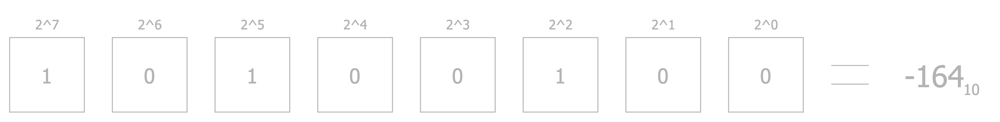
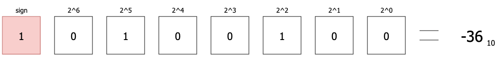
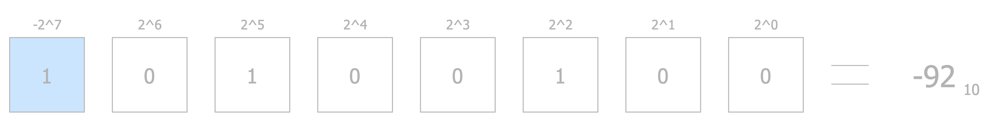
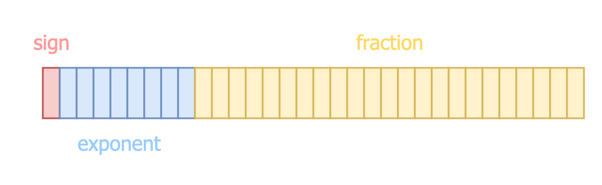
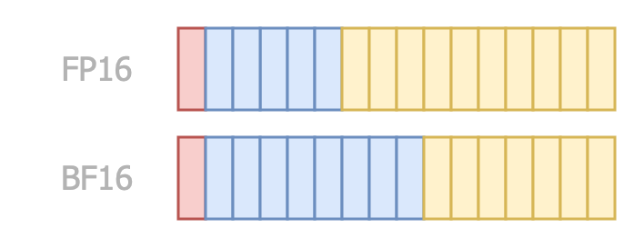
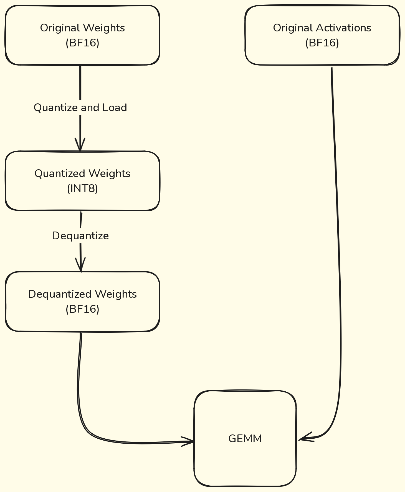
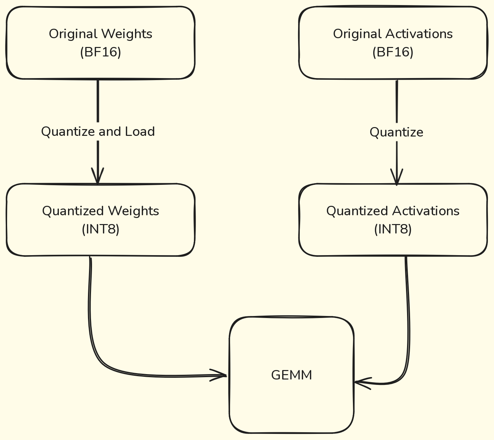

As humans, we perceive space and time as a seamless, continuous flow. This perception leads us to believe that continuity—and perhaps even infinity—is a fundamental aspect of nature. However, some scientific theories challenge this assumption. For example, **string theory** posits that the universe's fundamental components are tiny, vibrating strings, where different vibrations define different particles. Similarly, **loop quantum gravity** suggests that space itself is made up of discrete "grains," implying that reality might not be as continuous as it appears.

Why should this intrigue us, Machine Learning Surgeons? Because while we may experience continuity, **machines do not**. Machines operate strictly within the realm of discrete and finite data types, from bits and bytes to floating-point numbers. This disconnect raises a crucial question: **How can machines represent signals that seem continuous to us?** 

Consider the **spikes generated by neurons in the brain**. While neuronal activity appears continuous from a biological perspective, it can be interpreted as a series of discrete events—spikes or pulses. To model this activity on a machine, we sample these spikes at fixed intervals, effectively converting a seemingly continuous signal into a **discrete representation**. The choice of how finely we sample (and which data types we use) impacts the fidelity of our representation, affecting everything from signal reconstruction to downstream machine learning models.

This brings us to the core challenge: **quantization**—the process of mapping continuous values to discrete ones. Let's explore how this translation from the continuous to the discrete world shapes our data types and impacts machine learning performance!

## What is quantization
In the natural world, many signals—such as sound waves, light intensity, or even time itself—are (perceived) continuous. However, machines, by their very nature, operate in a discrete framework. They deal with bits, bytes, and finite representations of data. This fundamental limitation means that to store and process real-world signals, we must first translate them into a form that machines can understand. Enter **quantization**.

Quantization is the process of mapping a continuous range of values into a finite set of discrete levels. Think of it as breaking down a flowing river of data into buckets that can be cataloged and stored. For example:

* An audio signal, with its infinite variations in amplitude, must be sampled at specific intervals and its amplitude mapped to discrete levels.
* An image, representing continuous changes in light and color, is pixelated into finite, numerical values.

This conversion is essential for computation but comes with trade-offs. Quantization introduces **approximations**; a continuous signal can only be represented with a finite precision, leading to quantization errors. In fact, measure theory states that infinite precision is not achievable, not even in a theoretical setting. 

The following image illustrates the process of quantization. First, the signal is sampled at a specific rate, meaning values are selected along the x-axis at regular intervals. Here, we'll assume the x-axis represents time. On the y-axis, we have the amplitude of the signal, which is then mapped to a finite set of discrete levels.

The difference between the actual signal value and its closest quantized level is known as the **quantization error**. This error is an unavoidable artifact of the process, stemming from the approximation required to fit continuous values into a discrete framework:

")

At first glance, you might think this discussion has little to do with machine learning, especially since we're not directly talking about models. Why should we care about the quantization of real-valued, continuous signals like audio or images? And you'd be partly correct—our primary concern isn't the raw quantization of these signals.

Instead, the point here is to emphasize the **tradeoff** between the true value of a signal and its **representation within hardware**. Neural networks aim to mimic the inner workings of the human brain, which constantly produces electrical impulses and signals. In machine learning, these impulses are represented as **neuron activations**. However, these activations must ultimately exist within a machine, and machines operate within the constraints of discreteness and finiteness. This means that the continuous signals we're trying to emulate must be mapped into a discrete, finite set of values.

This is where data types come into play. The choice of data types for representing weights and activations in neural networks is absolutely critical. It impacts not only the **precision** and **accuracy** of the computations but also the efficiency of the entire system. And, as you'll see shortly, the requirements for data representation often differ significantly between the training and inference phases of a model.

Before diving into those differences, let's take a moment to refresh our understanding of numeric data types and their implications.

## Numeric Data Types
### Integers
Let's start with the simplest data type you can think of: the integer.

Representing an unsigned integer is straightforward. Given `n`, the number of bits used for representation, we simply use the binary representation of the number. Here's a quick refresher for those who might need it:

In this case, the range of the representation is \\([0, 2^n - 1]\\).

But what about signed integers? These require a way to handle both positive and negative numbers, and there are two common approaches for this:

One possible approach is called **Sign-Magnitude Representation**. In this method, the leftmost bit (most significant bit) represents the sign of the number: \\(0\\) for positive and \\(1\\) for negative. The remaining bits represent the magnitude. For example:

In this representation, the range of values is \\([-2^{n-1} + 1, 2^{n-1} - 1]\\).

Alternatively, the **Two's Complement Representation** can be used. Here, the leftmost bit is treated as having a negative value, allowing for a more elegant way to represent signed numbers. This method is widely used in modern computing because it simplifies arithmetic operations. For example:

With two's complement, the range of values becomes \\([-2^{n-1}, 2^{n-1} - 1]\\).

### Floating Point Numbers
Floating-point numbers are where things get interesting—and a little tricky. Unlike integers, they need to represent both whole numbers and fractions, which means we need more complex ways to store them. There are several standards for this, so let's dive in!

The most common one you've probably heard of is **IEEE 754**, which defines the famous **64-bit and 32-bit floating-point** formats, also called **FP64** and **FP32**. 

**FP64** splits 64 bits into three parts: 1 **sign** bit, 11 **exponent** bits and 53 **fraction** bits (often called the **mantissa** or **significant**).

Likewise, **FP32** splits its 32 bits into three parts: 1 bit for the sign, 8 bits for the exponent, and 23 bits for the fraction.

Here's what an FP32 number looks like:

The value of an FP32 number is calculated using this formula: 
\\((-1)^{sign} \times (1+ fraction) \times 2^{exponent-127}\\)

> Note: Don't stress about the formula! It's slightly different for subnormal numbers, but we can skip those for now.

Now, what's the point of splitting numbers this way? Each part has a job:

* The **sign** bit is obvious—it tells you whether the number is **positive** or **negative**.
* The **exponent** determines how big or small the number can get, **controlling the numeric range**.
* The **fraction** determines the **numeric precision**.

The kicker is that there's always a **tradeoff** between range and precision. With a fixed number of bits, you have to decide what's more important for your task. Do you need pinpoint accuracy, or do you need to handle really large (or tiny) numbers?

#### Beyond FP32
WFP32 offers a solid balance between precision, speed, and memory efficiency, especially compared to its big sibling, FP64. But here's the question: do we really need 32 bits for deep learning? As it turns out, the answer is often no. Experiments have shown we can go smaller, and that's where 16-bit data types come into play.

Let's start with FP16, or "half-precision." This format uses 1 bit for the sign, 5 bits for the exponent, and 10 bits for the fraction.

This smaller footprint makes FP16 faster and more memory-efficient, which is a big deal for inference tasks where every millisecond counts. However, there's a catch: those 5 exponent bits don't provide enough dynamic range to handle the wild swings in gradient values during training. Training a model in pure FP16 often leads to a drop in accuracy because the format struggles to represent very small or very large numbers accurately.

But don't lose hope! There's a clever workaround called mixed precision training. The idea is simple: keep the heavy-lifting math (like gradient calculations) in FP32 while using FP16 for everything else. This way, you get the efficiency of FP16 without sacrificing accuracy. We'll dive into the details of this technique soon.

To address FP16's limitations for training, Google introduced BF16 (Brain Float 16). BF16 keeps the 8-bit exponent from FP32 but reduces the fraction to 7 bits. This clever tweak gives BF16 nearly the same range as FP32, making it suitable for both training and inference. The reduced precision in the fraction doesn't hurt much in practice, especially for tasks like training deep neural networks where range matters more than pinpoint precision.

With BF16, you get a sweet spot: less memory usage than FP32 but enough dynamic range to handle training. That's why it's become a favorite in the deep learning community.

#### Even Smaller?
Why stop at 16 bits? When it comes to efficiency, smaller is better, and researchers are pushing the limits with even tinier formats.

One of the boldest moves is FP8. NVIDIA introduced FP8 to squeeze even more efficiency out of deep learning models. FP8 comes in two flavors: E4M3: 4 bits for the exponent, 3 for the fraction; E5M2: 5 bits for the exponent, 2 for the fraction.

If we extend the range to the maximum, we obtain the INT8 data type, which has been a popular choice in the last years.

Both versions focus on maximizing throughput and minimizing memory usage, making them perfect for large-scale inference tasks.

But wait—why stop at 8 bits? Let's talk about 4-bit formats.

INT4 is a simple 4-bit signed integer. Nothing fancy, but incredibly efficient.
This get a bit more interesting with FP4, which comes in variants like E1M2, E2M1, and E3M0, where you can decide how to split the few available bits between the exponent and fraction. These formats are still experimental but hold promise for ultra-fast inference on edge devices and other resource-constrained environments.

#### Why Do We Care?
All this talk about data types isn't just academic—it's mission-critical for machine learning. The data type you choose **affects everything**: speed, memory usage, and even the accuracy of your models. The key point is that for training, you need formats with enough precision and range (like FP32 or BF16) to capture subtle gradients and updates. For inference, though, you can often afford to go lower (FP16, FP8, or even FP4), with the compromise of losing in terms of accuracy.

Picking the right data type is like choosing the right scalpel in an operating room—you need the perfect balance of precision and efficiency for the task at hand. And trust me, as Machine Learning Surgeons, we always care about the tools we use.

## Quantization in practice
Alright, now that we've covered the basics of numeric data types, it's time to roll up our sleeves and dive into quantization!

In this section, we'll explore the how, when, what, and why of quantization, starting with a simple explanation and building up from there.

### How: Naïve Quantization Algorithms
There are many techniques for quantization, so it would be impossible to cover all of them here. However, let's focus on building a basic understanding of the process from a mathematical perspective. First and foremost, let's clarify something: when we quantize a tensor, we aim to reduce its values. Naturally, the values of the quantized tensor will exist in the same dimensional space but within a subset of its co-domain. To put it simply, we shrink the tensor's values (not its shape!) so that it can be represented using a data type that requires fewer bits.

For example, let's say we want to quantize a tensor in FP32 format, called \\(\mathrm{X}\\) into INT8 format—a significant leap! Since we're targeting the INT8 data type, all the values of the FP32 tensor must be mapped to integers in the range \\([-128, 127]\\).

Let's implement a very simple quantization technique called absolute maximum quantization.

#### Absolute Maximum Quantization
The first step is to compute a scaling factor. This factor is calculated by dividing the absolute maximum value of the tensor \\(\mathrm{X}\\) by the largest representable number in the target data type, which in this case is 127:


\\(\mathrm{S}= \frac{max|\mathrm{X}|}{127}\\)

Once we have the scaling factor \\(\mathrm{S}\\), we scale all the values in \\(\mathrm{X}\\), which we'll call \\(\mathrm{x_i}\\) and then round them to get the quantized values:


\\(\mathrm{q}_{i}= round(\frac{\mathrm{x_i}}{\mathrm{S}})\\)

If any values end up outside the representable range, we clamp them to fall within the range of the target data type.

Reconstructing the original values is straightforward. We just multiply the quantized values by the scaling factor:


\\(\mathrm{\hat{\mathrm{x_i}}}= \mathrm{q_i} * \mathrm{S}\\)

Of course, the reconstructed values won't be identical to the original ones due to approximations during the process. This difference is what we call the quantization error, something we touched on earlier.

One final thing to note about absolute maximum quantization: it's symmetric. This means the resulting tensor values are centered around zero, which is a nice property for certain applications.

#### Zero-Point quantization
For certain types of tensors, we can reduce the reconstruction error from quantization by using asymmetric quantization methods, such as zero-point quantization. This approach introduces an offset to account for the asymmetric ranges between the source and target data types, making it particularly useful when the data isn't centered around zero.

Zero-point quantization is still very straightforward to implement. 
To begin with, we compute the scaling factor. This factor represents the ratio between the range of values in the source tensor and the range of values that can be represented by the target data type. The computation adjusts for the difference in these ranges:


\\(\mathrm{S}= \frac{max(\mathrm{X}) - min(\mathrm{X})}{max\\_int - min\\_int}\\)

Once we have the scaling factor, the next step is to calculate the zero-point, which acts as the offset. This offset ensures that the minimum value of the source tensor aligns correctly with the minimum value of the target data type. The zero-point is determined based on the scaling factor and the range of values in the source tensor:


\\(\mathrm{Z}= round(min\\_int - \frac{min(\mathrm{X})}{\mathrm{S}})\\)

With both the scaling factor and the zero-point ready, we quantize the tensor. Each original value is scaled and then shifted by the zero-point offset to ensure it fits properly into the target data type:


\\(\mathrm{q}_{i}= round(\frac{\mathrm{x_i}}{\mathrm{S}}) + \mathrm{Z}\\)

Dequantization is just as simple. To reconstruct the original values, you reverse the process: first, shift the quantized values back by removing the zero-point offset, and then re-scale them to their original range. A word of caution here—make sure you shift back the values before applying the scaling factor, not the other way around!


\\(\mathrm{\hat{\mathrm{x_i}}}= (\mathrm{q_i} - \mathrm{Z}) * \mathrm{S}\\)

By using zero-point quantization, we can better preserve the original tensor's characteristics, especially when dealing with data that isn't symmetrically distributed. This method is a handy tool for minimizing quantization errors in such scenarios.

ToDo: insert code snippet (?)

### What: to Quantize
Now that we've explored a naïve way to perform quantization, let's discuss what to quantize.

To begin with, let's start at a very low level. Most of the computations in deep learning models involve matrix (tensor) multiplications. So, let's focus on the matrix multiplications between the input tensor \\(\mathrm{X}\\) and the weights \\(\mathrm{W}\\). A simple approach to quantization is to quantize the entire matrices. However, remember that the scaling factor depends on the values within the tensors. This means that using a finer granularity can help avoid or limit some potential numerical instability issues.

Consider a scenario where a tensor's values are sampled from a uniform distribution, but the minimum and maximum values are actually out-of-distribution (i.e., extreme values that don't represent the typical data). This can cause numerical instability during quantization because the scaling factor relies heavily on these two values.

To address this, we can use per-token and per-channel quantization. This approach involves quantizing a row of \\(\mathrm{X}\\) and its corresponding column in \\(\mathrm{W}\\) independently, so that the min and max values are computed at the token or channel level. By doing so, we mitigate the influence of out-of-distribution extreme values, leading to a more stable and accurate quantization process.

Up until now, we've discussed quantizing tensors in general terms. However, in the context of deep learning, we must decide whether to quantize the weights, the activations, or both. This decision is important because it affects both the precision of the model and its computational speed. Therefore, it's crucial to make this choice thoughtfully and with a clear understanding of the trade-offs involved.

### When: to Quantize
Deciding what to quantize is also closely related to when we want to perform quantization.

The most straightforward approach is post-training quantization. This involves taking a trained model and applying a chosen quantization algorithm. 

Let's stop for a second and think about what we can quantize using this approach. We don't have any particular limitation in this case: we surely can quantize the weights and the model when loading it in memory. However, if we quantize only the weights, the activations of the model will keep their original data type (let's say BF16). This means that in order to perform the multiplication between the weights and the activations, we must dequantize the weights before that. This adds a significant overhead. At the same time, statically quantize the activations of the model seems kinda impossible, since activations depends on  the input, which is only known at runtime, unlike the weights of the model that do not change overtime.

We can actually statically quantize the model's activations by using a calibration dataset, which will be used to observe the activations of the model and compute their distributions. These distributions are then used to determine how the specifically the different activations should be quantized at inference time.
In this way, we avoid the drawback of dequantization for allowing the matrix multiplication. 

Here's a visualization of both cases:

I know what you're thinking: the first case doesn't make any sense: why would be quantizing the weights if then we are dequantizing them before doing the GEMM? Trust me, there's a reason and I'll explain it in the Why section. <- change "Why section" with actual name TODO

This approach applies to static quantization. However, we could also choose dynamic quantization, where activations are quantized on the fly during inference. In this case, there’s no need for a calibration dataset, and the activation quantization becomes more accurate since it isn’t constrained by a pre-computed, limited distribution derived from the calibration data. The tradeoff remains the same: increased latency in exchange for better accuracy.

#### Quantization Aware Training
But what if post-training quantization lowers the model's performance too much? In such cases, we can turn to a more sophisticated technique called Quantization-Aware Training (QAT). This method simulates quantized computations during the forward pass while retaining higher-precision weights during backpropagation. By making the training process aware of the quantization, QAT helps the model adapt to the lower precision of its parameters, resulting in significantly better accuracy retention.

#### Mixed precision training
Since I brought it up earlier, let me briefly explain mixed precision training.

As mentioned before, FP16's dynamic range isn't large enough to store training gradients with sufficient precision. This limitation means that if we were to train entirely in FP16, we'd likely end up with a poorly performing model.

This is where mixed precision training comes in. The idea is straightforward: we start with FP32 weights and then quantize them to FP16 to speed up the inference during the forward pass. This results in FP16 gradients, which are then dequantized back to FP32. By doing this, we maintain numerical stability and avoid troublesome issues like vanishing or exploding gradients—fascinating phenomena to study but undesirable in practice.

After that, the process is business as usual. The optimizer step remains unchanged, wrapping up the training cycle with the stability of FP32 and the speed benefits of FP16.

### Why: the pros of quantization
Why are we doing quantization in the first place? Surely, we already discussed a lot about how quantization allows us to reduce the bits needed for representing the model, but the impact on the memory footprint is just one of the many benefits achievable using quantization.