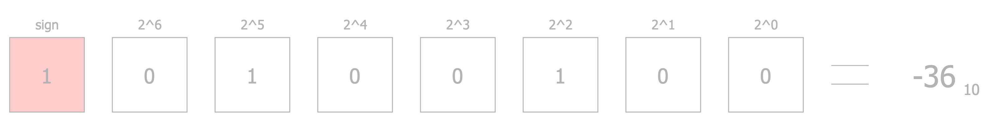

As humans, we perceive the space and time around us as continuous. This continuity suggests that the concept of infinity is intrinsic to nature. However, some theories challenge this view, proposing that reality might, in fact, be discrete. For instance, **string theory** posits that the fundamental building blocks of matter are tiny, vibrating strings, with their vibrations determining the properties of matter. Similarly, **loop quantum gravity** suggests that space itself is composed of "space grains," effectively making the fabric of the universe discrete.

Why does this matter to us, the Machine Learning Surgeons? Because we work with machines—and machines operate in a discrete world, no exceptions. This raises a critical question: If everything we achieve with machines is built on finite data, how do we define the data types we use? Moreover, what are the implications of choosing one data type over another when running machine learning models?

Let's dissect the topic and dive into quantization!

## What is quantization
In the natural world, many signals—such as sound waves, light intensity, or even time itself—are continuous. However, machines, by their very nature, operate in a discrete framework. They deal with bits, bytes, and finite representations of data. This fundamental limitation means that to store and process real-world signals, we must first translate them into a form that machines can understand. Enter **quantization**.

Quantization is the process of mapping a continuous range of values into a finite set of discrete levels. Think of it as breaking down a flowing river of data into buckets that can be cataloged and stored. For example:

* An audio signal, with its infinite variations in amplitude, must be sampled at specific intervals and its amplitude mapped to discrete levels.
* An image, representing continuous changes in light and color, is pixelated into finite, numerical values.

This conversion is essential for computation but comes with trade-offs. Quantization introduces **approximations**; a continuous signal can only be represented with a finite precision, leading to quantization errors. In fact, measure theory states that infinite precision is not achievable, not even in a theoretical setting. 

The following image illustrates the process of quantization. First, the signal is sampled at a specific rate, meaning values are selected along the x-axis at regular intervals. Here, we'll assume the x-axis represents time. On the y-axis, we have the amplitude of the signal, which is then mapped to a finite set of discrete levels.

The difference between the actual signal value and its closest quantized level is known as the **quantization error**. This error is an unavoidable artifact of the process, stemming from the approximation required to fit continuous values into a discrete framework:

")

At first glance, you might think this discussion has little to do with machine learning, especially since we're not directly talking about models. Why should we care about the quantization of real-valued, continuous signals like audio or images? And you'd be partly correct—our primary concern isn't the raw quantization of these signals.

Instead, the point here is to emphasize the **tradeoff** between the true value of a signal and its **representation within hardware**. Neural networks aim to mimic the inner workings of the human brain, which constantly produces electrical impulses and signals. In machine learning, these impulses are represented as **neuron activations**. However, these activations must ultimately exist within a machine, and machines operate within the constraints of discreteness and finiteness. This means that the continuous signals we're trying to emulate must be mapped into a discrete, finite set of values.

This is where data types come into play. The choice of data types for representing weights and activations in neural networks is absolutely critical. It impacts not only the **precision** and **accuracy** of the computations but also the efficiency of the entire system. And, as you'll see shortly, the requirements for data representation often differ significantly between the training and inference phases of a model.

Before diving into those differences, let's take a moment to refresh our understanding of numeric data types and their implications.

## Numeric Data Types
### Integers
Let's start with the simplest data type you can think of: the integer.

Representing an unsigned integer is straightforward. Given `n`, the number of bits used for representation, we simply use the binary representation of the number. Here's a quick refresher for those who might need it:

In this case, the range of the representation is \\([0, 2^n - 1]\\).

But what about signed integers? These require a way to handle both positive and negative numbers, and there are two common approaches for this:

1. **Sign-Magnitude Representation**
In this method, the leftmost bit (most significant bit) represents the sign of the number: \\(0\\) for positive and \\(1\\) for negative. The remaining bits represent the magnitude. For example:

In this representation, the range of values is \\([-2^{n-1} + 1, 2^{n-1} - 1]\\).

2. **Two's Complement Representation**
Here, the leftmost bit is treated as having a negative value, allowing for a more elegant way to represent signed numbers. This method is widely used in modern computing because it simplifies arithmetic operations. For example:

With two's complement, the range of values becomes \\([-2^{n-1}, 2^{n-1} - 1]\\).

### Floating Point Numbers
Floating-point numbers are where things get interesting—and a little tricky. Unlike integers, they need to represent both whole numbers and fractions, which means we need more complex ways to store them. There are several standards for this, so let's dive in!

The most common one you've probably heard of is **IEEE 754**, which defines the famous **32-bit floating-point** format, also called **FP32**. It splits its 32 bits into three parts:

* 1 bit for the **sign**,
* 8 bits for the **exponent**, and
* 23 bits for the **fraction** (often called the **mantissa** or **significant**).

Here's what it looks like:

The value of an FP32 number is calculated using this formula: 
\\((-1)^{sign} \times (1+ fraction) \times 2^{exponent-127}\\)

> ⚠️Note: Don't stress about the formula! It's slightly different for subnormal numbers, but we can skip those for now.

Now, what's the point of splitting numbers this way? Each part has a job:

* The **sign** bit is obvious—it tells you whether the number is **positive** or **negative**.
* The **exponent** determines how big or small the number can get, **controlling the numeric range**.
* The **fraction** determines the **numeric precision**.

The kicker is that there's always a **tradeoff** between range and precision. With a fixed number of bits, you have to decide what's more important for your task. Do you need pinpoint accuracy, or do you need to handle really large (or tiny) numbers?

#### Beyond FP32
FP32 is great, but not always necessary. Depending on the use case, you might opt for smaller formats that trade precision for efficiency. Here are a few:

* **FP16**: A 16-bit version of FP32, with 5 bits for the exponent and 10 for the fraction. It's faster and uses less memory, which makes it perfect for inference tasks.
* **BF16**: Google's take on a 16-bit float. It keeps the 8-bit exponent from FP32 but reduces the fraction to just 7 bits. Why? You keep a wide range but sacrifice some precision—great for training big models.

* **FP8**: NVIDIA's lightweight champion. FP8 comes in two flavors: E4M3 (4 bits for the exponent, 3 for the fraction) and E5M2 (5 bits for the exponent, 2 for the fraction). It's all about efficiency and memory savings.

#### Even Smaller?
Why stop at 8 bits? The bleeding edge is exploring 4-bit formats like **INT4** and **FP4**. INT4 is a simple signed integer, while FP4 gets creative with formats like **E1M2**, **E2M1**, and **E3M0**, depending on how the bits are divided. These ultra-low-precision formats are experimental but promising for making models faster and smaller.

#### Why Do We Care?
Floating-point formats aren't just technical trivia—they're a big deal in machine learning. Your choice of format **affects everything**: speed, memory usage, and even the accuracy of your models. For example:

* During **training**, you often need **higher precision** (like FP32 or BF16) to capture subtle gradients.
* For **inference**, **lower precision** (like FP16 or FP8) can be a game-changer, **cutting costs** without noticeably hurting performance.

So, understanding these formats helps you pick the right tool for the job. And trust me, in machine learning, it's all about picking the right tools. Just like in the operation room!

