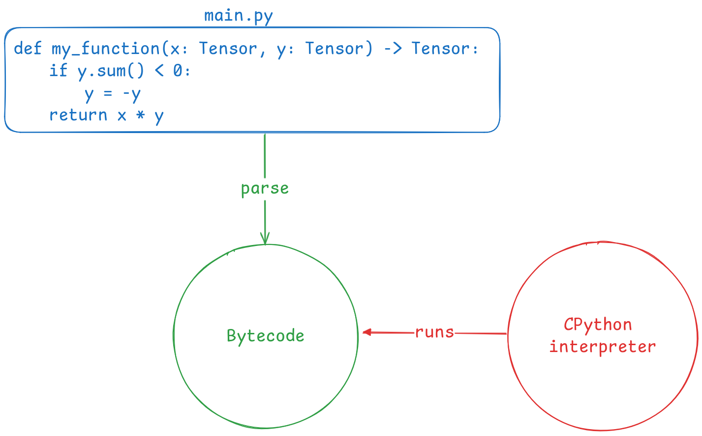
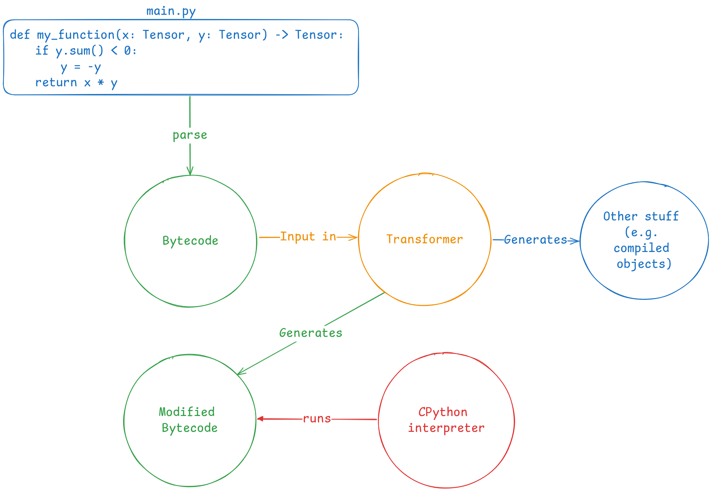

> You can take a look at the GitHub repository of this blogpost [**at this link**](https://github.com/DWarez/torch_compile_blogpost)

Remember when machine learning was done using `Caffe`? The ML Surgeon remembers that.
If you didn’t catch the reference, too bad for you!

In the last few days, I've been reflecting on how much easier machine learning has become in recent years. Not only do we now have a larger and higher-quality plethora of tools and frameworks—ones we could only dream of a few years ago—but the fact that these frameworks are so user-friendly is mind-boggling!

This got me thinking: are practitioners truly aware of the extreme complexity behind modern machine learning tools? Probably not. That’s why today, I want to dissect **Torch Compile**.

This article will be quite complex and lengthy, so gear up. But first, sterilize your hands.

## Dissecting torch.compile: A Surgeon’s Approach to PyTorch Optimization

At the end of 2022, PyTorch 2.0 was released, bringing with it a host of improvements and new features. Among them, the standout addition was undoubtedly **torch.compile**, a method designed to speed up PyTorch code. Its usage is quite straightforward: pass either a `torch.nn.Module` or a function to the method, and you’ll get an optimized version of it. For example:

```python
class MyModel(torch.nn.Module)
    ...

model = MyModel()
optimized_model = torch.compile(model)
```

The `optimized_model` will, hopefully, run faster than the originally instantiated model.
// ToDo: maybe remove
Later on, we’ll conduct some benchmarks to demonstrate these speedups. So far, so simple, right?

But what actually happens when we use `torch.compile`? How can a single line of code optimize a model and achieve up to 3x speedups compared to classic, eager-mode PyTorch?

To understand that, we’ll need to cut deeper—time to get some blood on our hands (or, ideally, gloves).

## Things to know before cutting deep

Before we dive into the complexities hidden within `torch.compile`, it’s essential to cover some foundational concepts. These basics are crucial for understanding the roles of the tools involved in the compilation pipeline. Trust me, the intricacies behind `torch.compile` are quite convoluted, and there’s a lot to grasp before you can see the full picture. So, please be patient and make sure you fully understand each step before proceeding to the next.

### Slicing Through the Layers: Dissecting PyTorch’s Computational Graphs

Have you ever wondered what really happens when you execute PyTorch code? If not, shame on you! Don’t take for granted the incredible features right at your fingertips!

Let’s start from the beginning. Suppose you have code like this pseudocode:

```
fn(x op y)
```

where, `x` and `y` are two tensors, `op` is an operation (like the product `*` or sum `+`), and `fn` is a function (like `log` or `sin`).

This syntax results in a **computational graph**, which represents the operations that will be performed on the tensors. Below is a simple sketch of the computational graph that would result from the code above:


In Pytorch, the graph is built **dynamically** as operations are applied to tensors, which is often referred as _define-by-run_.

But wait! That's only the forward step! We can’t train our models with just that!
Luckily for us, Pytorch provides [**autograd**](https://pytorch.org/docs/stable/autograd.html), a system responsible for automatic differentiation. It records operations on tensors to form an **autograd graph**.
Long story short, PyTorch automatically computes gradients for tensors. A computational graph for the backward pass looks something like this:


> ⚠️ Note: I forgot to add arrows from `op` and `Z` to the `Derivative Magic` block!

Damn, I'm good at drawing. Anyway, in case you missed your calculus classes, the notation \\(\frac{\partial Z}{\partial X}\\) and \\(\frac{\partial Z}{\partial Y}\\) stands for the partial derivative of `Z` with respect to `X` (or `Y`).

As you can see, there are a lot of graphs involved. So, guess what `torch.compile` does to these graphs? That’s right—it optimizes them to make the overall computation faster.

### Probing the Depths: Surgical Insights into PyTorch’s FX Graphs

Let’s dive deeper into the world of graphs. In the previous section, we explored the critical role of computational graphs. But how do we go about optimizing them? I’m not referring to techniques or methodologies—I'm talking about the nuts and bolts of how we can technically modify and optimize PyTorch's computational graphs.

To do that, we need a specialized toolkit. Fortunately, PyTorch equips us with just what we need: the [**FX**](https://arxiv.org/abs/2112.08429) toolkit.

The FX toolkit allows to modify `torch.nn.Module`s by implementing a pipeline consisting of a **symbolic tracer**, an **intermediate representation** (IR) and a **Python code generator**. This makes FX a powerful Python-to-Python transformation toolkit.

The symbolic tracer constructs a `torch.fx.GraphModule` by recording the operations that occur when the `nn.Module` is fed with fake data, called **proxies**.

A `GraphModule` is essentially a `nn.Module` generated from a `torch.fx.Graph`, which serves as the core data structure for FX’s internal representation.

With just a few lines of code, we can observe how the symbolic tracer and intermediate representation function:

```python
import torch
import torch.fx
import torch.nn as nn

class MyModule(nn.Module):
    def __init__(self):
        super().__init__()
        self.weights = torch.nn.Parameter(torch.rand(4, 4))
        self.linear = torch.nn.Linear(4, 5)

    def forward(self, x):
        return (self.linear(x) + x).relu()

m = MyModule()
gm = torch.fx.symbolic_trace(m)
print(gm.graph)
```

This script outputs the following graph representation:

```
graph():
    %x : [num_users=2] = placeholder[target=x]
    %linear : [num_users=1] = call_module[target=linear](args = (%x,), kwargs = {})
    %add : [num_users=1] = call_function[target=operator.add](args = (%linear, %x), kwargs = {})
    %relu : [num_users=1] = call_method[target=relu](args = (%add,), kwargs = {})
    return relu
```

This output shows the graph’s intermediate representation, which is made up of `Node`s. Without going too deep into the details, you can see references to module calls (e.g. `linear`), function calls (e.g. `add`), and method calls (e.g. `relu`). Each node also specifies the **args** for the operation, which are other nodes within the graph.

Once we have this graph, we can modify it as needed. Afterward, the **code generator** component takes over, creating a new `GraphModule` from the modified `Graph` data structure. I won’t dive into the specific techniques for modifying a graph here—this article is already long enough!

### Stitching Together Efficiency: Introducing CUDA Graphs

While we're on the subject of graphs, it’s worth highlighting another important feature: **CUDA Graphs**. Introduced in 2021, CUDA Graphs are a relatively new addition to the PyTorch ecosystem, specifically available for NVIDIA GPUs with CUDA version 10 or higher.

Typically, when operations are executed on the GPU, each kernel launch must be initiated from the CPU—a process that introduces noticeable overhead, especially when dealing with thousands of operations. Each individual launch might be small, but when accumulated, this overhead can impact performance.

CUDA Graphs address this by representing GPU operations as a single, cohesive graph. While building and launching this graph may initially be slower, the advantage lies in the fact that all subsequent operations remain on the GPU, significantly reducing the overhead caused by CPU-GPU communication.

The image below illustrates this concept perfectly:

")

## Into the Operating Room: Dissecting the Mechanics of Torch Compile

After all this talk about graphs, it's finally time to get down to business. Now, we’re ready to make the incision and dive deep into `torch.compile` to explore its inner workings. Armed with the knowledge we’ve gained in the previous sections, this should feel like a well-prepared field trip into the body of PyTorch, right? I certainly hope so—my head’s already spinning from the sheer complexity of it all!

### Operating on the Fly: Torch Dynamo’s JIT Bytecode Transformation

Let's start with a definition: **Torch Dynamo** is a Python JIT compiler that uses CPython's frame evaluation API to dynamically modify the bytecode generated from Pytorch source.
That sentence might sound a bit overwhelming, so let’s take it step by step.

First, what is **Just-in-time** (JIT) compilation? It’s a compilation process that occurs during the execution of a program, rather than before (as with languages like C). In Python, this means that while the program is running, its bytecode is translated into machine code, which the system then executes. Here’s a simple diagram to illustrate:



As you can see, the original Python source code is parsed into bytecode, which is easier to manage during execution. Now, thanks to the **frame evaluation API**, we can insert a middleware between the bytecode and the interpreter, as shown in the diagram below:



This is where **Torch Dynamo** comes in. It acts as a middleware, intercepting the bytecode to rewrite it and extract FX graphs from the PyTorch operations defined in the source code.

Since Dynamo operates just-in-time, it dynamically intercepts bytecode during execution and extracts graphs based on the current state of the code. This allows us to work with dynamic graphs, adapting to the changing flow of execution. However, for the sake of performance, we want to avoid re-capturing graphs every time the same code runs—doing so repeatedly, as seen in frameworks like JAX, would result in unnecessary overhead.

To address this, Dynamo uses **guards**. These guards are conditions that check whether the graph needs to be re-captured. If nothing significant has changed since the last run, Dynamo will use the previously captured graph, avoiding the need to reconstruct it from scratch.

Here’s a code snippet to illustrate how guards work:

```python
from typing import Callable, List
import torch
from torch import _dynamo as torchdynamo

def custom_compiler(graph_module: torch.fx.GraphModule, dummy_inputs: List[torch.Tensor]) -> Callable:
    graph_module.graph.print_tabular()
    return graph_module.forward

@torchdynamo.optimize(custom_compiler)
def example(a: torch.Tensor, b: torch.Tensor) -> torch.Tensor:
    x = a / (torch.abs(a) + 1)
    return x * b

for _ in range(100):
    example(torch.randn(10), torch.randn(10))
```

To observe Dynamo in action, run the script with the following command to enable the appropriate logging level:

```
TORCH_LOGS=guards uv run src/dynamo.py
```

Here’s a snippet of the output:

```
[__guards] | +- GuardManager: source=L['a'], accessed_by=DictGetItemGuardAccessor(a)
[__guards] | | +- TENSOR_MATCH: check_tensor(L['a'], Tensor, DispatchKeySet(CPU, BackendSelect, ADInplaceOrView, AutogradCPU), torch.float32, device=None, requires_grad=False, size=[10], stride=[1])  # x = a / (torch.abs(a) + 1)  # src/dynamo.py:14 in example
```

As you can see, the output shows guards being used. These are essentially assertions that determine whether the graph should be reused or re-captured. For example, the `check_tensor` guard verifies properties of the `torch.Tensor`, such as `dtype`, `device`, `requires_grad`, and `size`. If any of these properties change, the guard triggers a re-capture of the graph, ensuring that it remains accurate for the current execution.

### Handling Dynamic Flow with Surgical Precision: Torch Dynamo vs. Static Tracing Tools

One of the standout features of Torch Dynamo, compared to other tracing tools like TorchScript or FX tracing, is its ability to trace dynamic graphs that involve data-dependent control flow. In simpler terms, this means that the execution path of the code depends on a dynamic value, which makes it impossible to capture within a static graph.

Here’s a simple example:

```python
def function(x: torch.Tensor, y: torch.Tensor) -> torch.Tensor:
    return y if x.sum() > 0 else -y
```

In this case, the returned value depends on the sum of the tensor `x`. Because of this dynamic condition, the function can’t be traced by a tool that only works with static graphs.

If we attempt to trace this function using TorchScript, it will fail silently, producing a static graph. This means that even if the condition `x.sum() > 0` is false, the traced function will still return `y`, which is incorrect.

With **FX tracing**, however, we would get an exception like:

> `raise TraceError('symbolically traced variables cannot be used as inputs to control flow')
torch.fx.proxy.TraceError: symbolically traced variables cannot be used as inputs to control flow`

Trying to bypass this by providing concrete input arguments won’t work either, as FX tracing will still generate a static graph—leading to the same issues as TorchScript.

Although TorchScript can technically support data-dependent control flow, this requires significant changes to the codebase. Torch Dynamo, on the other hand, handles data-dependent control flow seamlessly, with no need for code modifications. When Dynamo encounters unsupported Python code (like control flow dependent on dynamic data), it breaks the computation graph, allows Python’s interpreter to process the unsupported code, and then resumes graph capture.

This feature also allows Dynamo to trace and optimize non-PyTorch code—another major limitation of both TorchScript and FX tracing.

### Torch Inductor: The Final Scalpel for Optimizing Computational Graphs

The last crucial tool in our arsenal is a compiler that knows how to transform the computational graph into highly efficient machine code. In this realm, this is typically called **deep learning compiler**. This is where **TorchInductor** comes in.

TorchInductor acts as the key performance engine for PyTorch’s deep learning models by compiling and optimizing the graph for both inference and training modes—something that many traditional backends struggle with. Most alternative backends are limited to **inference-only** optimizations, leaving a significant gap in performance during the training phase. TorchInductor fills this gap by targeting both modes of operation, offering a unified solution that performs well across different stages of machine learning pipelines.

TorchInductor supports both CPU and GPU architectures, adapting its optimizations based on the target hardware:

- For CPUs, TorchInductor generates highly efficient C++/[**OpenMP**](https://www.openmp.org/) code. OpenMP is a popular framework for parallel computing on CPUs, making it ideal for distributing workloads across multiple cores in modern processors. By leveraging OpenMP, Inductor ensures that the compiled code scales with CPU architectures for tasks like training and inference.

- For GPUs, the generated code is written in [**Triton**](https://openai.com/index/triton/), a high-level programming language designed for ease of use and speed, serving as a flexible alternative to CUDA. Triton is designed to simplify GPU programming by providing Python-like syntax, making it accessible to a broader range of developers. It supports NVIDIA GPUs with compute capability 7.0 or greater, as well as AMD GPUs with ROCm 5.2 or later. Though Triton’s support for CPUs is still evolving, its GPU capabilities make it a powerful ally in the quest for optimization.

#### Key Optimization Techniques with TorchInductor

Once the computational graph is fed into TorchInductor, a number of advanced optimization techniques are applied to significantly speed up the execution of your machine learning models.

- **Operation Fusion**

  One of the primary optimizations that TorchInductor performs is operation fusion. This technique merges multiple operations into a single kernel, reducing the overhead associated with launching separate kernels and minimizing memory bandwidth usage. By combining operations, the system executes more tasks with fewer memory transactions, leading to noticeable performance boosts. This is particularly effective for GPU optimization, where kernel launch overhead can become a bottleneck.

- **Memory Layout Transformations**

  Another key technique involves memory layout transformations. The layout of tensors in memory can have a substantial impact on performance, especially when accessing data in parallel. TorchInductor reorders tensors to match the access patterns of the target hardware, ensuring that memory accesses are efficient. This process helps reduce cache misses, improve memory locality, and maximize the performance of both CPU and GPU systems.

- **Loop Unrolling**

  For CPU-bound operations, loop unrolling is a critical optimization. It involves transforming loops to execute multiple iterations in one go, reducing the overhead associated with loop control and improving cache utilization. By expanding loops, TorchInductor increases the efficiency of the CPU's instruction pipeline, making it better suited to handle parallel workloads and improving overall throughput.

- **Parallelism and Hardware Utilization**

  TorchInductor doesn't just focus on memory and execution optimizations—it also maximizes hardware utilization through enhanced parallelism. For GPUs, this means leveraging more cores simultaneously, while for CPUs, this means distributing tasks efficiently across multiple cores. The overall effect is that models run faster and scale better across different hardware setups.

## Scalpel in Hand: A Practical Dive into torch.compile
Enough theory—let’s get our hands dirty! As any good surgeon knows, the best way to master a technique is through practice. In this section, we’ll explore the magic of `torch.compile` by dissecting its output and performance. We’ll first analyze what happens under the hood when we use `torch.compile`, and then we’ll run a benchmark to determine if the compiled function is truly faster.

Let’s start with a straightforward PyTorch function to keep things simple. This will allow us to focus on understanding how the compilation process works without being overwhelmed by complexity:

```python
def simple_fn(x: torch.Tensor, y: torch.Tensor) -> torch.Tensor:
    z = torch.matmul(x, y)
    return torch.nn.functional.softmax(z, dim=1)
```

Why this function?

1. **Readability**: It’s easier to understand and debug the logs with a minimal example compared to a full `nn.Module`.
2. **Interesting Output**: This function performs a matrix multiplication (`matmul`) followed by a softmax operation. These are common operations in deep learning, and their transformation during compilation will give us insights into PyTorch’s lower-level optimizations.

Now, let’s compile the function using `torch.compile` with the TorchInductor backend, and then run it with some random input tensors:

```python
# Create input tensors
x = torch.rand((100, 100))
y = torch.rand((100, 100))

# Compile the function using torch.compile() with TorchInductor backend
compiled_fn = torch.compile(simple_fn, backend="inductor")

# Call the compiled function
result = compiled_fn(x, y)
```

If we run this script with debugging enabled (`TORCH_COMPILE_DEBUG=1`), a folder named `torch_compile_debug` will appear in the directory where the script was executed. This folder contains artifacts from the compilation process, such as:

```sh
fx_graph_readable.py
fx_graph_runnable.py
fx_graph_transformed.py
ir_post_fusion.txt
ir_pre_fusion.txt
output_code.py
```

Let’s break down the most interesting files:

#### Intermediate Representation (IR)

The **Intermediate Representation** (IR) files provide snapshots of the computational graph before and after fusion. These files contain a low-level, abstracted view of the operations PyTorch will perform, allowing for optimizations to be applied.

1. **Pre-Fusion IR**: Shows the state of the computational graph before any optimizations have been applied.
2. **Post-Fusion IR**: Displays the graph after key optimizations, such as **operation fusion**, have been performed.

#### FX Graph Artifacts

The **FX graph** files offer another layer of insight into the internal workings of `torch.compile`. Let’s open `fx_graph_readable.py` to examine how PyTorch translates the original function into an intermediate, traceable format:

```python {linenos=true}
class <lambda>(torch.nn.Module):
  def forward(self, arg0_1: "f32[100, 100]", arg1_1: "f32[100, 100]"):
      # File: /home/dwarez/Documents/workspace/torch_compile/inductor.py:6 in simple_fn, code: z = torch.matmul(x, y)
      mm: "f32[100, 100]" = torch.ops.aten.mm.default(arg1_1, arg0_1);  arg1_1 = arg0_1 = None

      # File: /home/dwarez/Documents/workspace/torch_compile/inductor.py:7 in simple_fn, code: return torch.nn.functional.softmax(z, dim=1)
      amax: "f32[100, 1]" = torch.ops.aten.amax.default(mm, [1], True)
      sub: "f32[100, 100]" = torch.ops.aten.sub.Tensor(mm, amax);  mm = amax = None
      exp: "f32[100, 100]" = torch.ops.aten.exp.default(sub);  sub = None
      sum_1: "f32[100, 1]" = torch.ops.aten.sum.dim_IntList(exp, [1], True)
      div: "f32[100, 100]" = torch.ops.aten.div.Tensor(exp, sum_1);  exp = sum_1 = None
      return (div,)
```

Here:

- The graph is structured as a PyTorch `nn.Module` with a `forward` method.
- Each operation (such as `matmul` and `softmax`) is translated into lower-level **ATen** operations (`torch.ops.aten`), which represent the core tensor computations that PyTorch relies on.

The code clearly shows how PyTorch’s softmax function has been decomposed into its mathematical components:

1. **amax**: Maximum value extraction across the specified dimension.
2. **sub**: Subtraction of the maximum value from each element in the matrix.
3. **exp**: Exponentiation of the result.
4. **sum**: Summation across the same dimension.
5. **div**: Division to normalize the output, resulting in the final `softmax`.

This low-level breakdown reveals the granular steps involved in even simple operations, showing how TorchInductor prepares the graph for optimization.

When you see `torch.ops.aten`, it refers to **ATen**, the backend engine that powers PyTorch’s tensor computations. ATen is responsible for handling fundamental operations like matrix multiplication, element-wise functions, and reductions, ensuring that these operations are executed efficiently on both CPU and GPU.

Let’s dive into the contents of `fx_graph_runnable.py`, which provides another view of the computational graph. This file is generated as part of the artifact collection during the compilation process, and it’s crucial for understanding how PyTorch turns your high-level code into something that can actually run on your hardware.

Here’s what the file looks like:

```python
import torch
from torch import tensor, device
import torch.fx as fx
from torch._dynamo.testing import rand_strided
from math import inf
import torch._inductor.inductor_prims

import torch._dynamo.config
import torch._inductor.config
import torch._functorch.config
import torch.fx.experimental._config


torch._functorch.config.debug_partitioner = True
torch._functorch.config.unlift_effect_tokens = True


isolate_fails_code_str = None


# torch version: 2.4.1+cu121
# torch cuda version: 12.1
# torch git version: 38b96d3399a695e704ed39b60dac733c3fbf20e2


# CUDA Info:
# nvcc: NVIDIA (R) Cuda compiler driver
# Copyright (c) 2005-2024 NVIDIA Corporation
# Built on Wed_Aug_14_10:10:22_PDT_2024
# Cuda compilation tools, release 12.6, V12.6.68
# Build cuda_12.6.r12.6/compiler.34714021_0

# GPU Hardware Info:
# NVIDIA GeForce RTX 4060 : 1


from torch.nn import *
class Repro(torch.nn.Module):
    def __init__(self):
        super().__init__()


    def forward(self, arg0_1, arg1_1):
        mm = torch.ops.aten.mm.default(arg1_1, arg0_1);  arg1_1 = arg0_1 = None
        amax = torch.ops.aten.amax.default(mm, [1], True)
        sub = torch.ops.aten.sub.Tensor(mm, amax);  mm = amax = None
        exp = torch.ops.aten.exp.default(sub);  sub = None
        sum_1 = torch.ops.aten.sum.dim_IntList(exp, [1], True)
        div = torch.ops.aten.div.Tensor(exp, sum_1);  exp = sum_1 = None
        return (div,)

def load_args(reader):
    buf0 = reader.storage(None, 40000)
    reader.tensor(buf0, (100, 100), is_leaf=True)  # arg0_1
    buf1 = reader.storage(None, 40000)
    reader.tensor(buf1, (100, 100), is_leaf=True)  # arg1_1
load_args._version = 0
mod = Repro()
if __name__ == '__main__':
    from torch._dynamo.repro.after_aot import run_repro
    with torch.no_grad():
        run_repro(mod, load_args, accuracy=False, command='run', save_dir=None, tracing_mode='real', check_str=None)
        # To run it separately, do
        # mod, args = run_repro(mod, load_args, accuracy=False, command='get_args', save_dir=None, tracing_mode='real', check_str=None)
        # mod(*args)

```

By now you should be understaing this quite easily. Additionally to the `Repro` class (which is simply a runnable `nn.Module` of the computational graph), there's an **argument loader function**, called `load_args` and some useful **debugging information** in the comments, like CUDA version and underlying hardware.


Now, let’s take a look at the output code file (`output_code.py`), which contains the actual machine code generated by TorchInductor. Although the file is quite long, here’s a snippet that highlights a key portion:

```python
cpp_fused__softmax_0 = async_compile.cpp_pybinding(['const float*', 'float*', 'float*', 'float*', 'float*'], '''
#include "/tmp/torchinductor_dwarez/sk/cskh5dx62fglpphcrl6723dnmowdabouerrzy3dmqcngbxwfa7bv.h"
extern "C" void kernel(const float* in_ptr0,
...
```

What’s Happening Here?

* **C++ to Python Binding**: This snippet shows the generation of a C++ binding for the **fused softmax operation**. Here, PyTorch has automatically compiled the `softmax` function into efficient C++ code, and this function will be called directly during execution.

* **Asynchronous Compilation**: The `async_compile.cpp_pybinding` function allows this C++ kernel to be invoked asynchronously from Python, ensuring that the CPU or GPU isn’t sitting idle waiting for Python’s GIL (Global Interpreter Lock).

* **Fused Operations**: Notice that the `softmax` operation has been fused into a single C++ function. Operation fusion is one of the key optimizations that TorchInductor applies to improve performance by reducing memory bandwidth and kernel launch overhead.

### Benchmarking: Is the Compiled Function Actually Faster?
Let's put theory into practice and check if the compiled function outperforms the eager-mode function. We’ll use PyTorch's `torch.cuda` utilities to measure the execution time of both. Here’s the code:
```python
import numpy as np
import torch

N_ITERS = 10


def timed(fn):
    start = torch.cuda.Event(enable_timing=True)
    end = torch.cuda.Event(enable_timing=True)
    start.record()
    result = fn()
    end.record()
    torch.cuda.synchronize()
    return result, start.elapsed_time(end) / 1000


# Define a simple function
def simple_fn(x, y):
    z = torch.matmul(x, y)
    return torch.nn.functional.softmax(z, dim=1)


def generate_data():
    return (
        torch.randn((100, 100)).to(torch.float32).cuda(),
        torch.randn(100, 100).to(torch.float32).cuda(),
    )


# Compile the function using torch.compile() with TorchInductor backend
compiled_fn = torch.compile(simple_fn, backend="inductor")

eager_times = []
for i in range(N_ITERS):
    inp = generate_data()
    with torch.no_grad():
        _, eager_time = timed(lambda: simple_fn(inp[0], inp[1]))
    eager_times.append(eager_time)
    print(f"eager eval time {i}: {eager_time}")

print("~" * 10)

compile_times = []
for i in range(N_ITERS):
    inp = generate_data()
    with torch.no_grad():
        _, compile_time = timed(lambda: compiled_fn(inp[0], inp[1]))
    compile_times.append(compile_time)
    print(f"compile eval time {i}: {compile_time}")
print("~" * 10)


eager_med = np.median(eager_times)
compile_med = np.median(compile_times)
speedup = eager_med / compile_med
print(
    f"(eval) eager median: {eager_med}, compile median: {compile_med}, speedup: {speedup}x"
)
print("~" * 10)
```

When running this script, you might see an output like this:

```sh
eager eval time 0: 0.018083839416503905
eager eval time 1: 6.585600227117538e-05
eager eval time 2: 2.332800067961216e-05
eager eval time 3: 1.8239999189972877e-05
eager eval time 4: 1.744000054895878e-05
eager eval time 5: 1.6383999958634378e-05
eager eval time 6: 1.6383999958634378e-05
eager eval time 7: 1.711999997496605e-05
eager eval time 8: 1.5231999568641186e-05
eager eval time 9: 1.535999961197376e-05
~~~~~~~~~~
compile eval time 0: 0.8755618286132812
compile eval time 1: 0.00010204800218343735
compile eval time 2: 5.8816000819206235e-05
compile eval time 3: 4.831999912858009e-05
compile eval time 4: 4.790399968624115e-05
compile eval time 5: 4.1280001401901244e-05
compile eval time 6: 3.82080003619194e-05
compile eval time 7: 3.683200106024742e-05
compile eval time 8: 3.686400130391121e-05
compile eval time 9: 3.481600061058998e-05
~~~~~~~~~~
(eval) eager median: 1.7280000261962412e-05, compile median: 4.45920005440712e-05, speedup: 0.3875134564748722x
~~~~~~~~~~
```

Surprisingly, the compiled function was slower than the eager-mode one, with a speedup less than 1 (0.39x). Let's break down why this happens:

1. **Low Computational Complexity**: The benchmarked function is too simple: it performs just a matrix multiplication followed by a softmax. These operations are lightweight, meaning they don’t provide enough work for the compilation optimizations to shine. The overhead introduced by the compilation process outweighs the benefits of the optimizations, resulting in slower execution.

    In this case, there's no significant performance gain from calling a fused softmax function because there’s nothing substantial to fuse—just a basic matrix operation and activation function.

2. ***Compilation Overhead**: Notice that the first couple of iterations of the compiled function are **much slower** than the rest. This is due to the overhead introduced by the compilation step. The TorchInductor backend needs time to analyze and compile the computational graph into optimized code.
Once the graph is compiled, subsequent iterations are much faster because PyTorch uses the cached version of the graph, avoiding recompilation. So, if you run many iterations, the compilation time becomes less of a factor, and you’ll see the true performance gains.

3. **Eager Mode’s Instant Execution**: Eager mode is designed to run PyTorch operations immediately without any ahead-of-time optimizations, which is ideal for small, one-off operations like this. While compiled execution becomes faster over time, eager mode benefits from its simplicity and immediacy for lightweight tasks.


While this example shows a slowdown, that’s because the workload is too small to benefit from TorchInductor’s optimizations. Compiled execution shines when dealing with larger models or heavier workloads. For a more substantial example where the compiled function outperforms eager mode, check out [**this link**](https://pytorch.org/tutorials/intermediate/torch_compile_tutorial.html#demonstrating-speedups).


## 

Hey! Torch just called me GPU-poor! Not cool!
https://discuss.pytorch.org/t/torch-compile-warning-not-enough-sms-to-use-max-autotune-gemm-mode/184405
https://github.com/pytorch/pytorch/blob/e5f5bcf6d4ec022558caf4d0611d928497394a88/torch/_inductor/utils.py#L644-L645
